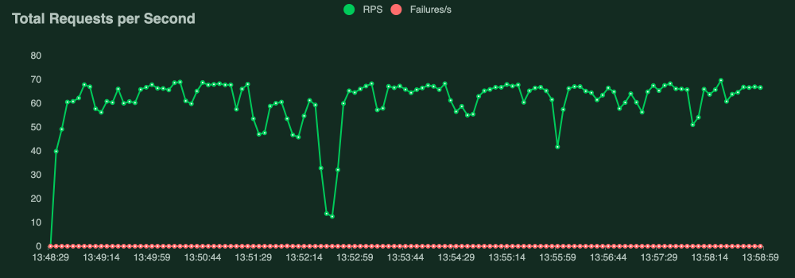
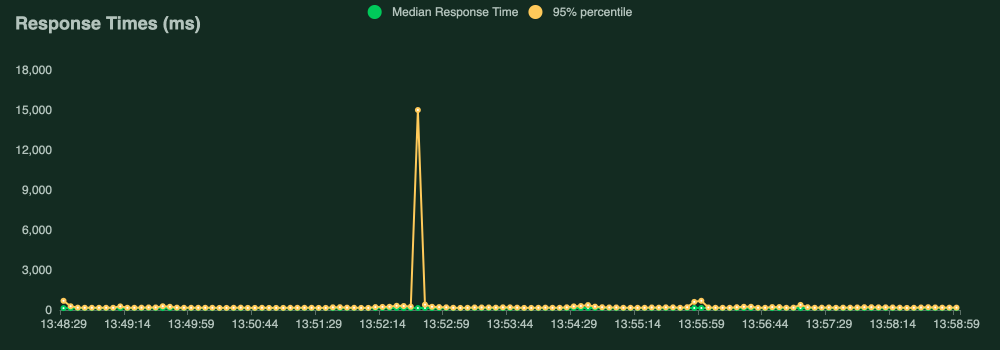
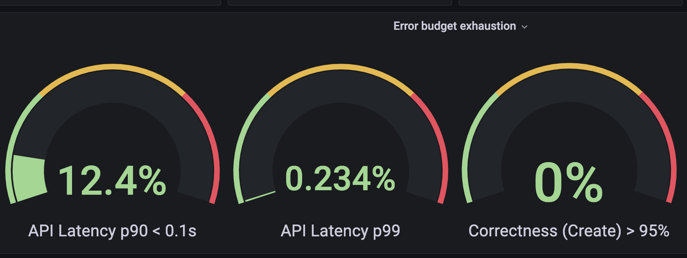

## ACS Fleet Manager load testing

### Overview

This document describes an ad-hoc manual load tests 
and measurements done by the ACS Fleet Manager dev team in August 2022. 
There will be up to 5 users on the first stage after ACS Fleet Manager release.
Currently, ACS Fleet Manager does not have an automated processes to execute load tests. 
If the ACS team create an automation CI for load testing in the future, 
this document will be updated accordingly.

### Rerun load test

See ACS Fleet Manager documentation: https://github.com/stackrox/acs-fleet-manager/tree/main/e2e/loadtest

### Brief summary

- The service memory consumption is not affected by the number of users and their request rate.
- The service heap consumption is not affected by the number of users and their request rate neither.
- The service CPU consumptions grows linearly by the number of request rate.
- Neither memory leaks nor artifact resource consumption were found.

### Areas of potential concern

- Response time under load can significantly rise during rolling deployment of new service version.
  It will lead to exhausting API Latency SLIs error budget.
- Due to lack of AWS RDS metrics, this load testng session did not cover ACS Fleet Manager AWS RDS performance.

### Testing setup

[Locust](https://locust.io/) was used for performing request and configure testing load.
The load testing was performed against stage environment.
An endpoint which triggers SSO auth and AWS RDS query was used as the request target.
There will be up 5 active users initially after service release. 
Thus, ACS team decided to not spawn an overwhelming number of concurrent request.
The RPS ranges between 7 for single user up to 70 for multiple users. 

### Results and interpretations

#### Single user load testing

This load test simulated ~7 RPS from the same user.

##### Locust overview for single user load test:

There were 12333 requests and every request was successful.

##### Locust request rate:

RPS was mostly stable during testing run.

##### ACS Fleet Manager request rate metric:

ACS Fleet manager RPS metric correlates with locust data.

##### ACS Fleet Manager response code metric:

ACS Fleet manager response code metric also shows that every request received 200 code.

##### ACS Fleet Manager memory consumption metrics:

According to the metrics there is no significant changes in memory or heap consumption with increase request rate.

##### ACS Fleet Manager CPU consumption metric:

CPU consumption grows linearly with request rate.

#### Multiple users load testing

This load test simulated ~70 RPS from multiple users.
In addition, there was a deployment during load test to see how it 
effects metrics.

##### Locust overview for single user load test:

There were 39102 requests and every request was successful.

##### Locust request rate:

RPS was mostly constant except for deployment period between 13:52:15 and 13:52:45.
Deployment is also noticeable in response time chart below:

There was one request which took 15 seconds.

##### ACS Fleet Manager request rate metric:

ACS Fleet manager RPS metric correlates with locust data.

*Note:* The growth is smooth because metrics visualisation used `sum(rate())` functions. So the data was smeared in 10 minutes interval.
The current visualisation no longer spreads the metric data.

##### ACS Fleet Manager response code metric:

ACS Fleet manager response code metric indicates that every request ended up with 200 code.

##### ACS Fleet Manager memory consumption metrics:

Similar to single user load test, there is no significant changes in memory or heap consumption with increase request rate.
Also, tis metric clearly shows deployment time frame.

##### ACS Fleet Manager CPU consumption metric:

CPU consumption grows linearly with request rate.

#### SLO/SLI metrics after load testing

SLO/SLI gauges did not significantly change after load testing as shown below:

The only noticeable observation was slightly increase in error budget exhaustion for API latency SLIs.

