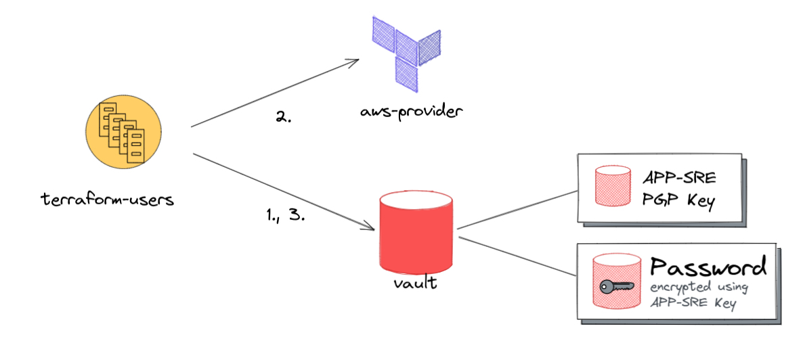
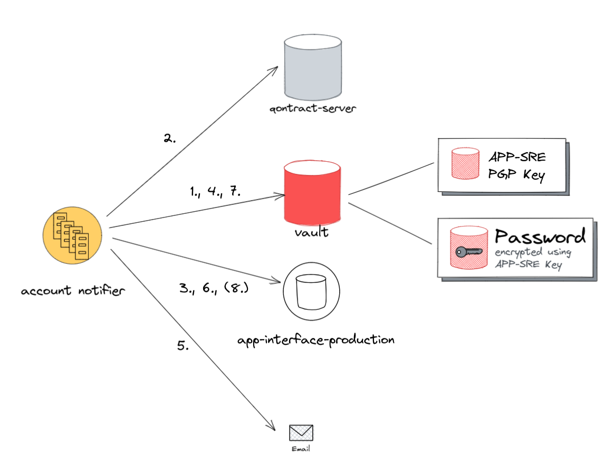

# Design document - aws login profile encryption

## Author / Date

Jan-Hendrik Boll
October 2022

## Tracking JIRA

https://issues.redhat.com/browse/APPSRE-4706

## Problem statement

The Terraform AWS provider supports creating random passwords for login profiles on the creation of these. Conveniently terraform encrypts this password using a PGP Key that can be passed in. We added some validation code (user-validator), that checks if PGP Keys are usable and fails on keys that do not comply with terraform imposed key standards (obsoleted key standard).
Additionally, if no PGP Key is provided the password will be stored in the state file: https://github.com/hashicorp/terraform-provider-aws/blob/main/internal/service/iam/user_login_profile.go#L152
Thus we care for using a valid PGP Key, but it's unlikely users care, because the password here is a random one and we enforce the users to change it upon first login. So it's pretty common that they forget about it once their request (account provisioning) was settled.

Conclusion: PGP Keys need validation. Different reasons for this:

* Terraform requires certain compliance due to its implementations
* Keys might have a restricted lifetime and expire

## Goals

* Terraform users integration is not crashing due to invalid or expired PGP Keys.
* Merge Request pipeline is not breaking due to expired PGP Keys
* Users get notified upon tried usage of invalid keys

## Proposal

Instead of using the PGP Key provided by users directly in terraform, we can use a PGP Key maintaned by APP-SRE for encrypting every login password. 

A second, to be built integration is then picking up this password from vault and re-encrypts it with the user provided PGP Key. It will then send it via e-mail to the user, as before done by terraform-users. By decoupling this from terraform we can leverage the latest PGP versions available and lift any restrictions opposed by the terraform implementation.

### AWS Login Profile creation / password reset



Flow for creating a new login profile (only mentioning aspects of PGP Key usage):

 1. Read APP-SRE PGP key from vault and use it as input for **every** login profile created.
 1. Create login Profile with APP-SRE key as input parameter, the password generated by terraform will be encrypted by that key. Login profiles are created with the option set, that users must change their passwords on the first login. So, this stored password gets stale quickly.
 1. Read the generated password from the terraform output and write it to vault.


### Key notification



 1. Read newly created passwords from vault.
 2. Read the users PGP Key from qontract-server.
 3. Check state bucket `app-interface-production` if the users key needs rotation (would be set by earlier runs, see paragraph below).
 4. Read APP-SRE PGP Key to unencrypt the password.
 5. Encrypt the password using the users public PGP Key and send it to the user, as email.
 6. Store the encrypted password in vault, so that the app-interface output job can export them.
 7. Remove password encryted using APP-SRE key from vault.
 8. (Optional): remove state denoting users key needs rotation.


In the case the PGP Key of the user expired, we end the previous sequence before 4 and instead of sending the re-encrypted password, we send a notification to the user, that a new PGP Key is required. After that we create a state file entry in `app-interface-production` indicating, that this PGP needs rotation.

### state file usage

The state bucket `app-interface-production` will be used to persist information about invalid keys. We create a state key, that will hold the following information:

 * PGP key
 * invalidation reason 

### Output 

We publish generated passwords via [app-interface-output](https://gitlab.cee.redhat.com/service/app-interface-output/-/blob/master/terraform-users-credentials.md), so users can copy it from there. This is based on a qontract-reconcile cli command `terraform-users-credentials`, which reads the console URL and encrypted password from the terraform statefile. Since we switched to the APP-SRE PGP Key, these passwords can not be used anymore. Instead the new integration will write the encrypted password to vault, along with the console URL and Username. The output CLI command will read the information from that place instead of the statefile.

### User-validator

Since the new integration can handle expired PGP Keys gracefully, the PGP key validation on the user-validator needs to be updated. User-validator should read the list of invalid PGP Keys from the `app-interface-production` bucket and skip validation for keys listed as invalid.

### Additional use cases

* This new integration could notify users about PGP Key expiration. Not only check in vault for new keys, but query existing keys from qontract-server, validate them and reuse the notification implementation.
* We can use the new integration for secret sharing with user. We can add a new schema, that tracks vault secret sharing i.e.:
  ```
  ---
  $schema: /app-interface/secret-sharing.yml
  vault-secret:
    $ref: /services/vault.devshift.net/config/prod/devshift-net.yml
    secret:
      key:
      version:
  user: 
    $ref: /teams/abc/user/foobar.yml
  ```

## Alternatives

* Adding an expiration notifier: https://issues.redhat.com/browse/APPSRE-4706
* Use self hosted pastebin instead of PGP
* Refactor user-validator to just check a single key passed via stdin
  * In MR checks, use schema comparison to find the key being referenced by the change in the MR and only test this. (for terraform-users, sql-query, requests_sender and aws-iam-password-reset)
  * Exit with error on validation error. This should break only the MR opened concerning the broken key.
  * This would work under the assumption that pgp keys are not validated by i.e. terraform

## Milestones

* create new integration that can:
  * encrypt keys from vault and send them PGP encrypted to users
  * send notifications on failed encryption attempts and retry encryption
* update terraform-users to use app-sre PGP Key and write secrets to vault
  * add a feautre toggle to accounts, that indicate if passwords should be sent encrypted or written to vault
* update qontract-reconcile cli output tool, to read from vault
* update account per account to the new behaviour
  * PGP keys can be replaced, since lifecycle configuration on resource exists, that ignores key changes
