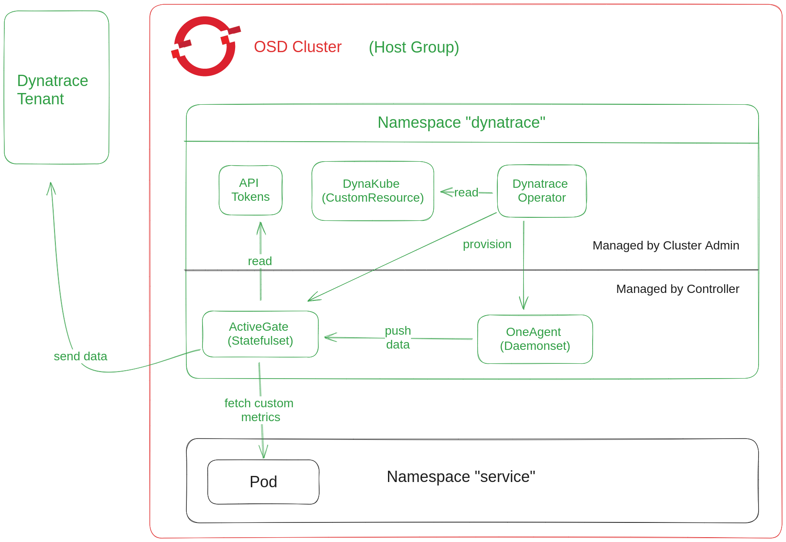

# Design Document - Dynatrace Log Ingestion

[toc]

## Author / Date

Karl Fischer / July 2023

## Tracking JIRA

[APPSRE-7561](https://issues.redhat.com/browse/APPSRE-7561)

## Problem statement

We need a mechanism to ingest OCM logs with Dynatrace.

## Goals

* AppSRE can easily install Dynatrace into OSD clusters.
* An app-interface tenant (OCM) must be able to easily enable log ingestion with Dynatrace.

## Non-Goals

* Dynatrace for non-OSD clusters. We solely focus on the OCM logs use-case which required OSD.
* API Token management. This is part of separate effort.
* Dynatrace Environment (Tenant) Management. We assume there is a single Dynatrace Environment for now. Managing multiple environments is part of a different effort.

## Dynatrace Introduction



Dynatrace has multiple components required for monitoring / log ingestion. These components are deployed into the same namespace `"dynatrace"`.

One important aspect about Dynatrace logging is that it must be configured through the API. I.e., you must configure through the API exactly which namespaces should be logged. Unlike the metrics collection case, Dynatrace does not support resource annotations or similiar for logging.

### Dynatrace Tenant

Dynatrace follows the concept of Environments. I.e., each environment has an ID which identifies the API endpoint to use, e.g., `https://$(environment-id).live.dynatrace.com`. Each environment can be regarded as a tenant with its own resource limits and data bounds, i.e., one tenant cannot see the data of another tenant.

### ActiveGate

ActiveGate is a Statefulset that is managed by the Dynatrace Operator. The ActiveGate acts as a gateway between components within the cluster and the Dynatrace Tenant. I.e., the ActiveGate is the only component that interacts with the Dynatrace Tenant directly. It is responsible for pushing monitoring and logging data to the tenant. Further, ActiveGate can directly query custom metrics from pods based on their annotations. ActiveGate requires an API Token secret in its namespace.

### OneAgent

OneAgent is a Daemonset. It is mainly responsible for pushing logs from the hosts to the ActiveGate. OneAgent is managed by the Dynatrace Operator.

### DynaKube

DynaKube is a custom resource. You can regard it as a configuration that is read and reconciled by the Dynatrace Operator. This DynaKube configuration contains parameters about the ActiveGate and OneAgent modes.

### Host Groups

Every DynaKube defines a Dynatrace Host Group. For us a Host Group is simply all hosts of a cluster. I.e., each cluster is exactly one unique Host Group.

## Proposal


### Resources

All Dynatrace components are resources in app-interface:

- Dynatrace Operator is deployed as a [shared resource](https://gitlab.cee.redhat.com/service/app-interface/-/blob/34e9650e3495e8dae8ea9856341be477012c2739/data/services/app-sre/shared-resources/dynatrace-operator.yaml)
- All Dynatrace resources are [managed in app-interface](https://gitlab.cee.redhat.com/service/app-interface/-/tree/master/resources/setup/dynatrace)

### Log Configuration

As stated in the introduction, we must use the Dynatrace API to configure which namespaces should be logged. We have a [job template](https://gitlab.cee.redhat.com/service/app-interface/-/blob/d682a17bf8612a2cc8eee0f5354981b6841e4a6b/resources/setup/dynatrace/log-config-job.yaml.j2) deployed in the `dynatrace` namespace. That job issues curl commands to configure the API according to a [gql query](https://gitlab.cee.redhat.com/service/app-interface/-/blob/7c1bb8994d2eb1c2c3c685f652fa193f20fc1e8c/resources/queries/dynatrace/namespaces-for-cluster.graphql).

#### Error Handling

The job uses Openshift's native retry with exponential backoff. After 10 minutes of retries it will reach a failed state. We add a prometheus alert [DynatraceConfigJobFailed](https://gitlab.cee.redhat.com/service/app-interface/-/blob/3e68b9492e3f4b50714f1a066307a8868a4bc6f8/resources/observability/prometheusrules/app-sre-dynatrace-config-jobs.prometheusrules.yaml) to be aware of any configuration errors.

#### Life Cycle Management

Dynatrace allows a single log rule to inhibit multiple namespace matchers. I.e., we can have a single log rule for each cluster (Host Group) that keeps track of all our namespaces for that cluster. Since we only have a single rule, we simply override that rule each time with the latest desired state, which simplifies life-cycle management tremendously.

#### Detect Changes

We use app-interface's built-in template query mechanism to dynamically collect all the namespaces for a cluster that we would like to log. We build a hash from that logging enabled set of namespaces and apply that as [a suffix to the job name](https://gitlab.cee.redhat.com/service/app-interface/-/blob/d682a17bf8612a2cc8eee0f5354981b6841e4a6b/resources/setup/dynatrace/log-config-job.yaml.j2#L14). I.e., any change in the namespace set will lead to a new job name which makes openshift-resources delete the old job and create a new one to apply latest desired state.

### Schema Changes

To simplify configuration we introduce Dynatrace as a new dependency.

**data/dependencies/dynatrace/staging/us-east-1.yml:**
```
---
$schema: /dependencies/dynatrace-environment-1.yml
labels: {}

name: dynatrace-staging-us-east-1
description: Dynatrace Environment for staging us-east-1
environmentUrl: https://ddl70254.live.dynatrace.com

# This can potentially be extended in the future to provision api tokens to the dynatrace namespace via an integration
#apiToken:
#  path: app-interface/app-sre/dynatrace/staging/us-east-1
#  field: token
#  version: 1
```

The Dynatrace dependency can be set per-cluster. 

**data/openshift/app-sre-stage-01/cluster.yml:**
```
dynatrace:
  $ref: /dependencies/dynatrace/staging/us-east-1.yml
```

Note, that we only support one Dynatrace environment per-cluster as of now. The ActiveGate component can only speak to a single Dynatrace environment. Multiple ActiveGates require multiple DynaKubes, which results in multiple OneAgent Daemonsets. However, a host can only accomodate a single OneAgent, i.e., we would need to segment our hosts into multiple log groups to achieve a multi Dynakube setup. The issue is tracked in [DI-76](https://issues.redhat.com/browse/DI-76).

## Alternatives Considered

* Initially we had problems to configure logs via [Dynatrace Terraform Provider](https://registry.terraform.io/providers/dynatrace-oss/dynatrace/latest). That provider turned out to not be feasible for the Hypershift case. Main reason being that the [entity data sources](https://registry.terraform.io/providers/dynatrace-oss/dynatrace/latest/docs/data-sources/entities) did not possess all the attributes that you have available in the API and that are needed for Hypershift's more dynamic use-case. This problem was addressed and supposedly fixed in [this issue](https://issues.redhat.com/browse/DI-61). Another issue remaining was the terraform pipeline itself: who runs terraform and manages the state. For reasons of simplicity hypershift decided to not use terraform at this stage. We want to align our mechanism as closely as possible with Hypershift and thus also decided to not use terraform.
* Create a qontract-reconcile integration for log configuration. We considered this too much effort at this stage of the project. A job is simpler, less intrusive and more revertable right now. However, we might reconsider in the future once we have more experience (and requirements) around Dynatrace.
* Use `terraform-repo` to rollout terraform for log config. `terraform-repo` is not ready at this stage to handle this non-AWS case. That being said, we might reconsider in the future.

## Milestones

1. `app-sre-stage-01` namespaces are sending logs (github-mirror, glitchtip)
2. rollout to uhc integration and staging
3. rollout to uhc production
4. make this generally available to our tenants via announcement and documentation
