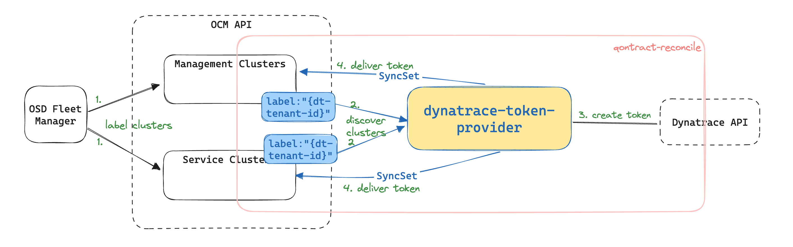

# Design Document - Dynatrace Token Provider

[toc]

## Author / Date

App SRE / Aug 2023

## Tracking JIRA

[SDE-3300](https://issues.redhat.com/browse/SDE-3300)
[APPSRE-8108](https://issues.redhat.com/browse/APPSRE-8108)

## Problem statement

We need a safe and repeatable way for Hypershift management and service clusters to get the Dynatrace token that they need in order to send metrics, logs etc to the corresponding Dynatrace environment(also called tenant). Currently the [design](https://docs.google.com/document/d/1VW-mEYLYlIeQ8XERZ5TYUmFQZd9Hfumi_c_PWejoJjs/edit) is for all the clusters to have a cluster bootstrap token, which provider access to create and maintain another token for the cluster to send data to Dynatrace. There were concerns raised because the cluster bootstrap token being static in all the clusters. Even though those clusters are Red Hat internal clusters for now, this is still a security concern, especially if we ever want to ship content to Dynatrace from customer clusters as well.

## Goals

* Hypershift hive-managed management clusters and service clusters can get dedicated Dynatrace token for specified Dynatrace environment.

## Non-Goals

* Integrate all existing Dynatrace environments into App Interface
* Any clusters that's out of the cases mentioned above.
* Who and how the labels are going to be added to the clusters (osd-fleet-manager ideally should be responsible).
* Token recycle. This should be defer to the cloud platform that issue the token, which is Dynatrace in this case. 

## Proposals

Let's use a qontract-reconcile integration called dynatrace-token-provider to achieve following workflow:

1. The cluster owner will use [the subscription or organizations label](https://service.pages.redhat.com/dev-guidelines/docs/sre-capabilities/framework/ocm-labels/) for SRE capabilities to identify the clusters that is eligible. The label will contain the information of which Dynatrace environment it needs access to(tenant ID). 
2. Then our integration will discover those clusters through OCM API. (We do similar things in rhidp integration [here](https://github.com/app-sre/qontract-reconcile/blob/master/reconcile/rhidp/common.py#L42))
3. The integration will then create an new access token that with minimal scope to send data for that cluster by calling [Dynatrace API](https://www.dynatrace.com/support/help/dynatrace-api/environment-api/tokens-v2/api-tokens/post-token) using the bootstrap token. 
    * The bootstrap token will be created manually for all the Dynatrace environments and saved to vault for now (There are currently eight Dynatrace environments and four of them already have bootstrap token saved in vault [here](https://vault.devshift.net/ui/vault/secrets/app-sre/list/creds/dynatrace/redhat-aws/bootstrap-api-tokens/) during the dynatrace-config repo tenant bootstrapping).
4. dynatrace-token-provider calls [SyncSet API](https://api.openshift.com/#/default/post_api_clusters_mgmt_v1_clusters__cluster_id__external_configuration_syncsets) to persist the token in `dynatrace` namespace.

Essentially we want to remove the need for clusters to own or store the bootstrap token. While we are aware that App Interface and qontract-reconcile as a internal platform isn't the best option to serve the external customer use cases, but security wise it is still a valid mitigation. Moreover there is a pressing timeline (Dynatrace Milestone 2 coming up on August 18th) to address mentioned concern and we do have a proven effective framework and precedence. The idea is to use this integration as a prototype and it will be extracted as a service from qontract-reconcile when we have other use cases than Hypershift infrastructure. This is in alignment with the SRE capabilities evolution model.

To avoid unexpected use cases, when clusters are retrieved from OCM API, the organizations that they belong to will need to be allowed by cross referencing App Interface. We also want to make sure that when the integration failed due to user error, App SRE are not responding as we are to regular integration, i.e. there will be no pager created for this integration.

Under the situation when tokens are leaked, cluster owners(in this case Platform SREs) will need to go to Dynatrace to revoke and delete token. Then the integration will create another token with the same name and overwrite the old token with the new one.

## Alternative considered

There were a lot of discussion around doing this in other places such as [ocm-sendgrid-service](https://gitlab.cee.redhat.com/service/ocm-sendgrid-service), osd-fleet-manager or a standalone service in OCM ecosystem. However those approaches will depend on other team's availability, which is unrealistic with the Dynatrace Milestone 2 timeline.

## Risks

We will be making regular API calls to OCM and Dynatrace, which brings the risk of being throttled following unexpected behavior, for example, the token can failed to be created as SyncSet if we got throttled from OCM and the token can get lost. As first step of mitigation, we'll make sure the integration makes as few as API calls as possible, and have monitoring in place. Considering the current use cases are limited to Hypershift clusters we will accept this risk and leave further mitigation (cache, exponential back-off etc) later.

## Milestones
1. Bootstrap token created, and new integration merged, tested in one cluster
2. dynatrace-toke-provider deploys tokens to management and services clusters (This will be a joined effort among SREs working on Dynatrace)
