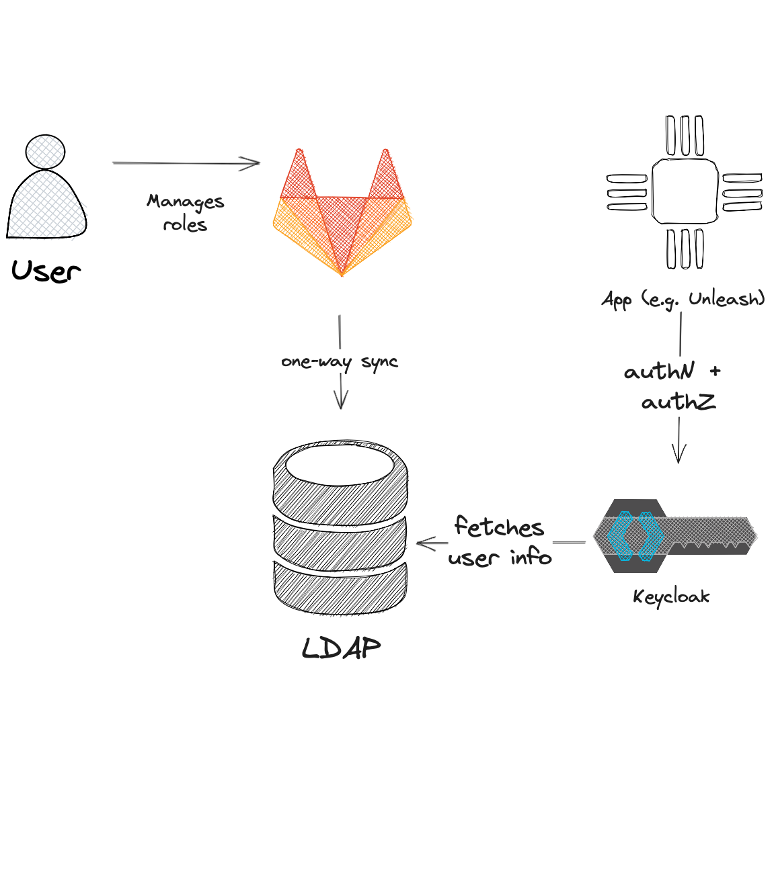

# Design doc: LDAP group management

[toc]

## Author/date

Christian Assing / July 2023

## Tracking JIRA

[APPSRE-8037 - ldap group management](https://issues.redhat.com/browse/APPSRE-8037)

## Problem Statement

App-Interface allows tenants to conveniently manage user permissions and roles and use them in several services, e.g., Slack, Vault, or Glitchtip. However, to use those settings, a dedicated qontract-reconcile integration is needed that syncs the permissions/roles to the application (e.g., `glitchtip-projects`), but this can't be done if an application doesn't persist permissions and roles (e.g., [Unleash](https://www.getunleash.io/)).

A widespread authorization pattern used by applications is to use LDAP groups. Such groups can be either consumed via LDAP directly or via `realms.roles` attribute in Red Hat SSO access token.

Currently, tenants must manage LDAP groups outside of App-Interface, which is inconvenient and error-prone.

## Goals

Allow tenants to consume App-Interface roles (`$schema: /access/role-1.yml`) via LDAP groups.

## Nongoals

n/a

## Proposals

### LDAP API by ITIAM

ITIAM provides an HTTP API to create and manage LDAP groups. The API is documented in [Internal-Groups](https://gitlab.corp.redhat.com/it-iam/internal-groups) repo.

The authentication is done via OIDC with special service accounts, and the authorization is based on group name prefixes.

The proposed prefix is `ai-`.


### Schema extension

Enhance App-Interface roles schema (`$schema: /access/role-1.yml`) with an optional `ldap-group` attribute.

```yaml
---
$schema: /access/role-1.yml

labels: {}
name: app-sre

ldapGroup: app-interface-app-sre
```

Instead of a hidden group name calculation algorithm, a dedicated `ldapGroup` attribute allows us to support multiple group prefixes, e.g., `app-interface-`, and validates the group name.

The specified LDAP group will be created if it doesn't exist, and all users in a role will be added as members. The LDAP group won't be manageable outside App-Interface, e.g., via [Rover Groups](https://rover.redhat.com/groups/). See [Full Control](https://gitlab.corp.redhat.com/it-iam/internal-groups/-/blob/main/docs/namespaces.md#full-control) for more information.

Unleash as an example:



## Alternatives considered

n/a

## Resources

* [[unleash] RedHat SSO auth](https://issues.redhat.com/browse/APPSRE-7900)
* [SDE-2124 - [SRE Capability] Feature flags](https://issues.redhat.com/browse/SDE-3124)
* [Internal-Groups](https://gitlab.corp.redhat.com/it-iam/internal-groups)

## Milestones

1. Get approval and [an LDAP service account](https://issues.redhat.com/browse/ITIAM-5564) from ITIAM
1. Implement a qontract-reconcile integration that manages LDAP groups
