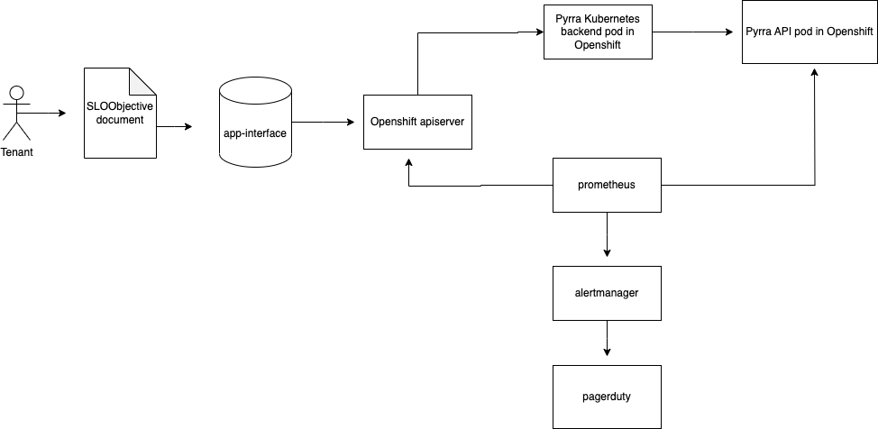

# Design doc: Pyrra Integration Implementation

## Author/date

Suzana Nesic (snesic) / 2023-07-17

## Tracking JIRA

[APPSRE-8062](https://issues.redhat.com/browse/APPSRE-8062)

## Problem Statement

AppSRE enables tenants to model SLOs in YAML and uses automation to create metrics, alerts, and dashboards. The current tool, SLO-libsonnet, allows tenants to assist in the creation of SLOs. SLO-libsonnet input files and the generated rules are also hard for AppSRE to review.

## Goals

Through the adoption of Pyrra, an automated SLO generator, we can not only offer tenants the same assistance but we can also have an endpoint that shows all of the SLO budgets that are created and have Pagerduty alert us whenever the multi burn rate for a particular SLO is firing. With this centralized SLO reporting tool, we can also enable managerial consumption and visibility.

We would also take all existings SLOs/alerts currently out in app-interface and recreate it through Pyrra.

## Non-objectives

* This is only based on SLOs created, not any other alerts tenants would like to create.
* This effort for the meantime will be focused on Pyrra end to end with Pagerduty. FedRAMP efforts rely on Goalert instead of Pagerduty so a spike will need to be done in order to see how to have Pyrra work with Goalert and leave the schema changes to an optional value for tenants to use to reduce FedRAMP impact.

## Proposal

### Architecture



The service would consist of two pods within each cluster we would want Pyrra implemented in. The two pods are the Kubernetes backend pod and the API pod. The backend pod watches for new SLO objects within the Openshift cluster and creates Prometheus rules for each object. The API pod delivers information about SLOs from a backend to the UI, which is supported by the API pod. This service allows creates a `CustomResourceDefinition`called a `servicelevelobjectives.pyrra.dev`, which is what is needed by the tenant to create these error budgets in Pyrra.

### App-Interface Integration

The current implementation of Pyrra is a tenant will upload a SLO Objective file to app-interface and have that file referenced in the appropriate `openshift-customer-monitoring` namespace file. Once the SLO Objective file is merged into app-interface and in an Openshift cluster, the Kubernetes backend pod will find that file and translate it into a `PromtheusRule` object and can be seen in Prometheus. The API pod will also create the error budgets for that SLO and is all presented for the UI.

Example of the SLO Objective file:

```
apiVersion: pyrra.dev/v1alpha1
kind: ServiceLevelObjective
metadata:
  labels:
    prometheus: app-sre
    role: alert-rules
  name: prometheus-http-errors-test-fail
  namespace: openshift-customer-monitoring
  annotations:
    pyrra.dev/runbook: "Place for a runbook link"
    pyrra.dev/message: "This is a generated pyrra alert for prometheus-http-errors-test-fail"
    pyrra.dev/dashboard: "grafana dashboard link"
    pyrra.dev/link_url: "Openshift console link url"
spec:
  alerting: {}
  description: ""
  indicator:
    ratio:
      errors:
        metric: prometheus_http_requests_total{job="prometheus-app-sre",code=~"2.."}
      total:
        metric: prometheus_http_requests_total{job="prometheus-app-sre"}
  target: "99.99"
  window: 2w
```

The AppSRE specific template can be found in this [repository](https://github.com/app-sre/pyrra-template).

### Pyrra Installation and Monitoring

Pyrra will be deployed through a [saas file](https://gitlab.cee.redhat.com/service/app-interface/-/tree/master/data/services/observability/cicd/saas/saas-pyrra.yaml).

For monitoring the service overall, we can monitor the following with alerts:
- When the Pyrra UI endpoint is down.
- When the Pyrra service is experiencing downtime.
- When the two Pyrra pods have restarted too many times in a short window.

### What Would Pyrra Replace

Pyrra would replace the SLO-libsonnet project we recommend for tenants to use as they are onboarding their service. Pyrra can also replace or take over what the `slo-document-1` schema provides.

Here is an example of that schema:
```
---
$schema: /app-sre/slo-document-1.yml

labels:
  service: <service-name>

name: <name-of-document>

app:
  $ref: <path/to/app.yml>

namespaces:
  - $ref: <path/to/namespace.yml>

slos:
  - name: Status-Board API Latency
    SLIType: latency
    SLISpecification: Percentage of the requests responded under 1 second.
    SLODetails: https://gitlab.cee.redhat.com/service/app-interface/-/blob/master/docs/status-board/slos/status-board-latency.md
    SLOParameters:
      window: 28d
    expr: |
      (sum(rate(api_inbound_request_duration_bucket{namespace="status-board-production",job="status-board-metrics",le="1",code!~"5.."}[{{window}}]))
      /
      sum(rate(api_inbound_request_duration_count{namespace="status-board-production",job="status-board-metrics",code!~"5.."}[{{window}}])))
    SLOTarget: 0.99
    SLOTargetUnit: percent_0_1
    prometheusRules: /observability/prometheusrules/status-board-slo-production.prometheusrules.yaml
    prometheusRulesTests: /observability/prometheusrules/status-board-slo-production.prometheusrulestests.yaml
    dashboard: https://grafana.app-sre.devshift.net/d/statusboard/status-board?orgId=1&var-datasource=app-sre-stage-01-prometheus
```

In the example provided, Pyrra has the opportunity to replace the `slos` section with the data needed from the `ServiceLevelObjective` template and use qontract-reconcile and qontract-schemas to transform that information into a `ServiceLevelObjective` object in Openshift.

### Integration Changes to Incorporate Pyrra

#### slo-document-1 schema
As mentioned above, Pyrra has the opportunity to integrate and/or replace some components within the `slo-document-1` schema. The currently schemas provides a lot of metadata that allows AppSRE engineers to quickly detect services so it would be better to have some kind of reference to the `ServiceLevelObjective` within the `slo-document-1` schema file rather than completely deprecating the file.

The template could look like the following:
```
---
$schema: /app-sre/slo-document-1.yml

labels:
  service: <service-name>

name: <name-of-document>

app:
  $ref: <path/to/app.yml>

namespaces:
  - $ref: <path/to/namespace.yml>

slos:
...

pyrraSLO:
- name: prometheus-http-errors-test-fail
  annotations:
    pyrra.dev/runbook: "Place for a runbook link"
    pyrra.dev/message: "This is a generated pyrra alert for prometheus-http-errors-test-fail"
    pyrra.dev/dashboard: "grafana dashboard link"
    pyrra.dev/link_url: "Openshift console link url"
  spec:
    alerting: {}
    description: ""
    indicator:
      ratio:
        errors:
          metric: prometheus_http_requests_total{job="prometheus-app-sre",code=~"2.."}
        total:
          metric: prometheus_http_requests_total{job="prometheus-app-sre"}
    target: "99.99"
    window: 2w
```

This change would require some changes within qontract-schema to recognize these new fields. Also, this would require some changes in qontract-reconcile, where we can query all of the `slo-document-1` files and catch all of the relevant Pyrra information into a yaml file of type `ServiceLevelObjective` and have that file as the final product out in Openshift.

#### app-interface reports - SLO section

The service SLO currently reports on `Cluster/Namespace`, `SLO Document`, `SLO Name`, `Grafana`, and `SLO Value/SLO Target`. The `SLO Target` value can be taken from the `ServiceLevelObjective` `target` value. The `SLO Value` would be collected from the error budgets that are created from the `ServiceLevelObjective` file.

### Drawbacks of Pyrra

- Some changes to the Pyrra Github project will need to be made to Pyrra to have it fully run on our Openshift clusters. One of the changes, for example, is having the Prometheus URL configurable as the Pyrra project assumes you are deploying the service within the `openshift-monitoring` namespace. This can be fixed by making such PRs but the merge time and new package release may vary.
- The severity of the multi burn rate alerts are currently fixed to `critical` for `1d` and `2d` exhaustion and `warning` for `1w` and `2w` exhaustion. This is something that should be kept in mind by us and our tenants when it comes to alerting so neither party is potentially spammed with alerts.
- Not all is known about what can potentially be replaced from the `slo-document-1` schema. With this integration, it would be made sure that the Pyrra path can run along with any duplicate efforts before anything is decomissioned.

### Extra Links

- Pyrra template [repository](https://github.com/app-sre/pyrra-template)
- [Pyrra SOP](https://gitlab.cee.redhat.com/service/app-interface/-/blob/master/docs/app-sre/sop/pyrra.md)
- Pyrra deployment [console view](https://console-openshift-console.apps.app-sre-stage-0.k3s7.p1.openshiftapps.com/k8s/ns/pyrra/core~v1~Pod) on app-sre-stage-01
- [SLO examples](https://gitlab.cee.redhat.com/service/app-interface/-/tree/master/resources/observability/pyrra-slo) deployed through app-interface
- Pyrra [endpoint](http://pyrra-api-pyrra.apps.app-sre-stage-0.k3s7.p1.openshiftapps.com) for app-sre-stage-01
_ Pyrra [project](https://github.com/pyrra-dev/pyrra)

## Alternatives considered
N/A

## Milestones
- Pyrra deployed in all environment
- Pyrra tested in Staging and Production
- New onboarded apps after above two steps are using Pyrra
