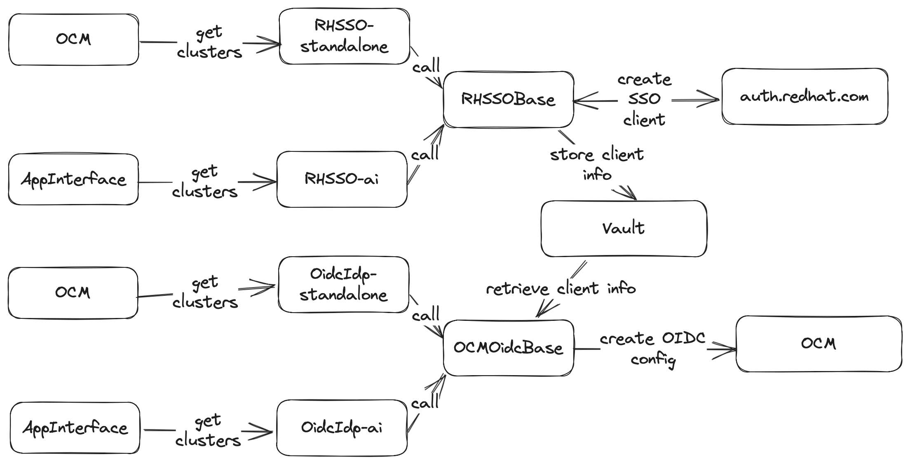

# Design doc: [SRE Capability] Red Hat IDP

[toc]

## Author/date

Christian Assing / June 2023

## Tracking JIRA

[[SRE Capability] Red Hat IDP](https://issues.redhat.com/browse/SDE-2620)

## Problem Statement

Enabling Single-Sign-On (SSO) for an OpenShift cluster is a common requirement for AppSRE, and Red Hat IT provides [Red Hat SSO](https://auth.redhat.com) for this purpose.

To enable SSO for a cluster, you must create a new SSO client on auth.redhat.com and configure the OIDC authentication on the OpenShift cluster to use this SSO client. While the OIDC cluster configuration can be done via OCM API, the SSO client creation on auth.redhat.com is [manual](https://source.redhat.com/groups/public/identity-access-management/it_iam_internal_sso_int_idp_wiki/how_to_get_sso_for_your_application_or_vendor). This manual step includes a SNOW ticket with Red Hat IT and may take several days or weeks to complete. Additionally, to create such a SNOW ticket and the resulting SSO client, it needs a more profound knowledge of [OpenID Authorization Code Flow](http://openid.net/specs/openid-connect-core-1_0.html#CodeFlowAuth) and [OpenShift OIDC configuration](https://docs.openshift.com/container-platform/4.13/authentication/identity_providers/configuring-oidc-identity-provider.html).

Automating the SSO client creation on auth.redhat.com and the OIDC cluster configuration via OCM API makes sense to overcome this burden and speed up cluster onboarding for Red Hat engineering teams and AppSRE.

## Goals

1. Use the SSO client configuration capability for App-Interface managed clusters to speed up cluster onboardings. The OIDC configuration part is already covered by [OpenID Connect (OIDC) Identity Provider (IDP)](docs/app-sre/sop/oidc-idp.md) integration.
1. Make Red Hat SSO cluster authentication (SSO client and OIDC config) [a self-serviceable offering](https://source.redhat.com/groups/public/sre/wiki/red_hat_sso_idp_for_osdrosa_authentication) for Red Hat engineering teams without AppSRE and App-Interface touchpoints.

## Non goals

- Support model-specific alerting for SRE capabilities - this will be covered in Milestone 2 of the [SRE capabilities initiative](docs/app-sre/initiatives/sre-capabilities.md)
- Dedicated runtime environment for SRE capabilities - this will be covered in Milestone 3 of the [SRE capabilities initiative](docs/app-sre/initiatives/sre-capabilities.md)

## Proposals

An OIDC authentication capability for OpenShift clusters consists of the following components:

* An SSO client configurated on auth.redhat.com
* An OIDC client configuration using the SSO client on the OpenShift cluster configured via OCM

The proposal is to split the capability into two parts:

* A capability that manages the SSO client configuration on auth.redhat.com
* A capability that manages the OIDC client configuration on the OpenShift cluster

Splitting the work into two parts allows us to reuse this capability for App-Interface managed clusters, easier code flow, code testing, and having a proper reconciliation loop for both parts.

Both capabilities will be available in two flavors:

* One flavor gets the clusters to manage via OCM cluster subscription labels (`sre-capabilties.rhidp: "enabled"`)
* The second one will get the clusters from App-Inferface

And both use the same code base. Later, the App-Interface flavor will be refactored to label the clusters in OCM and use the OCM flavor too.

### SSO client configuration (RHSSO)

The SSO client configuration is managed via the [dynamic client registration API of Red Hat SSO](https://access.redhat.com/documentation/en-us/red_hat_single_sign-on/7.0/html/securing_applications_and_services_guide/client_registration#openid_connect_dynamic_client_registration). Details about the API can be found in the [OpenID Connect Dynamic Client Registration 1.0](https://openid.net/specs/openid-connect-registration-1_0.html) specification.

The workflow for the SSO client configuration is as follows:

1. Create a new SSO client on auth.redhat.com if it does not already exist
1. Retrieve `client_id`, `client_secret`, and `registration_access_token` and store them in Vault

`client_id` and `client_secret` are needed later to configure the OIDC authentication via OCM. `registration_access_token` is required to update or delete the SSO client on auth.redhat.com. Unfortunately, the SSO client registration API does not allow retrieving the `registration_access_token` after the initial client creation, and deletion of the SSO client can only be done with the `registration_access_token`. This means that the `registration_access_token` needs to be stored in Vault.

Additionally, the [OpenID Connect Dynamic Client Registration 1.0](https://openid.net/specs/openid-connect-registration-1_0.html) specification doesn't include a way to retrieve all SSO clients registered for a given realm. So the SSO client configuration capability needs to keep track of all SSO clients it created.

### OIDC client configuration (OidcIdp)

OIDC client configuration is managed via the [OCM API](https://api.openshift.com). The OIDC client configuration capability will create a new OIDC client configuration for the given cluster and update it if it already exists. The existing [qontract-reconcile code](https://github.com/app-sre/qontract-reconcile/blob/master/reconcile/ocm_oidc_idp.py) for OIDC client configuration will be reused.

The App-Interface flavor (aka integration) of this capability will use the cluster app-interface settings to configure the OIDC client. The OCM flavor won't have any user configuration and will use the default settings, e.g., claim names.

### Alerting

For now, alerting for the integrations (App-Interface flavors) will follow the qontract-reconcile alerting scheme (tl;dr: a failing reconcile run will trigger a page after some time). To conform to the dissimilarities in the support model between integrations and capabilities, the OCM flavor will not fail for situations uncovered by the support model. These situations will be highlighted to users via OCM service logs and will not trigger pages for AppSRE.

Milestone 2 of the [SRE capabilities initiative](docs/app-sre/initiatives/sre-capabilities.md) will work on a support model-specific alerting for SRE capabilities.

## Alternatives considered

### Alternative 1: One capability for both SSO client configuration and OIDC configuration

This alternative would also have the SSO client configuration capability to configure the OIDC configuration via OCM API. This approach would have the following advantages and drawbacks:

#### Advantages

* The `client_id` and `client_secret` would be in-memory and passed to OCM right after client creation; no need to store them in Vault.

#### Drawbacks

* No reconciliation loop is possible for the OCM OIDC configuration because `client_id` and `client_secret` are not available after the initial client creation
* More complex code flow and testing.

#### Conclusion

`registration_access_token` must be stored in Vault to track created SSO clients and allow the deletion on auth.redhat.com. Why not store `client_id` and `client_secret` in Vault too?

## Milestones

### Milestone 1

Implement both SSO client configuration flavors

### Milestone 2

Implement both OIDC client configuration flavors

