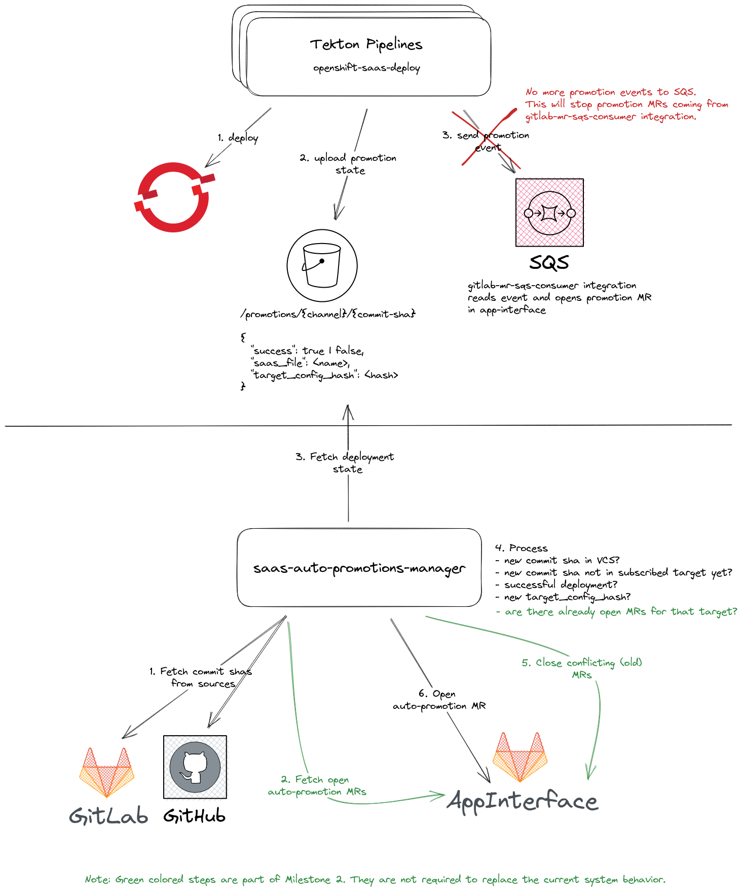

# Design document - SaaS Auto Promotions Manager Integration

[toc]

## Author / Date

Karl Fischer
March 2023

## Tracking JIRA

[APPSRE-6941](https://issues.redhat.com/browse/APPSRE-6941)

## Problem statement

We often see merge conflicts in auto-promotion MRs created by our devtools bot.

Auto promotion MRs are currently created after a tekton deployment pipeline successfully
finished a deployment job. Tekton pipelines are not fully context aware, i.e., they
do not know the current state of open MRs. Further, pipelines can potentially run in parallel, which makes it even harder to gain full context.

An auto promotion process can take some time and involve multiple MRs.
If during that time another deployment happened in the publisher target, then a potentially
parallel auto promotion process is started, resulting in MRs that have merge conflicts.

### Current Implementation

### Issue

The following timeline highlights how multiple parallel promotions can result in merge conflicts. In essence, a new promotion is triggered before a previous promotion finished for the same saas target. A promotion has to pass several steps: send to SQS, read from SQS, open MR, merge MR. Note, that the promotion data, i.e., the ref to update, is part of the SQS event. I.e., once the event is sent to SQS, it is prone to merge conflicts for subsequent promotions.

## Goals

* Solution to avoid merge conflicts in auto-promotions

## Non-Goals

* Do not replace current `saas-trigger-*` integrations. Solely focus on auto-promotions.
* Do not refactor `saasherder.py`

## Proposal

We have a [PoC available](https://github.com/app-sre/qontract-reconcile/pull/3306) for this proposal.

Create a new fully context aware integration: `saas-auto-promotions-manager` (SAPM). Remove the auto-promotion event from `openshift-saas-deploy`. Without these events, `gitlab-me-sqs-consumer` will not receive any data to open auto promotion MRs anylonger.

SAPM is able to gather all context around auto-promotions:

- whats the commit sha of a saas file target ref?
- is there a successful deployment for a new commit sha?
- are there already open MRs for the subscribed target?

Based on that context, SAPM can decide:

1. Do we have to open a new auto-promotion MR?
2. Do we have to close old (now obsolete) auto-promotion MRs?

The [current PoC](https://github.com/app-sre/qontract-reconcile/pull/3306) implements Milestone 1, i.e., it does not do any merge conflict management yet. It is a very simple single-threaded integration. The runtime is bound by the number of subscribed SaaS targets. Even though it only uses a single thread one run currently happens in < 2 mins for latest app-interface prod state. Threading will enhance runtime considerably, as we could easily query VCSs in parallel.

Further, SAPM is not required to hold state. It must anyways fetch real-world state directly from VCSs. 

## Alternatives Considered

- leverage timestamps and shas from deployment state instead of querying VCSs directly. We decided against that because a timestamp does not guarantee a proper order of commits. (a pipeline might be very slow)

## Milestones

1. SAPM re-creates current behavior and replaces openshift-saas-deploy auto-promotion events.
2. SAPM manages MRs to avoid merge conflicts.
