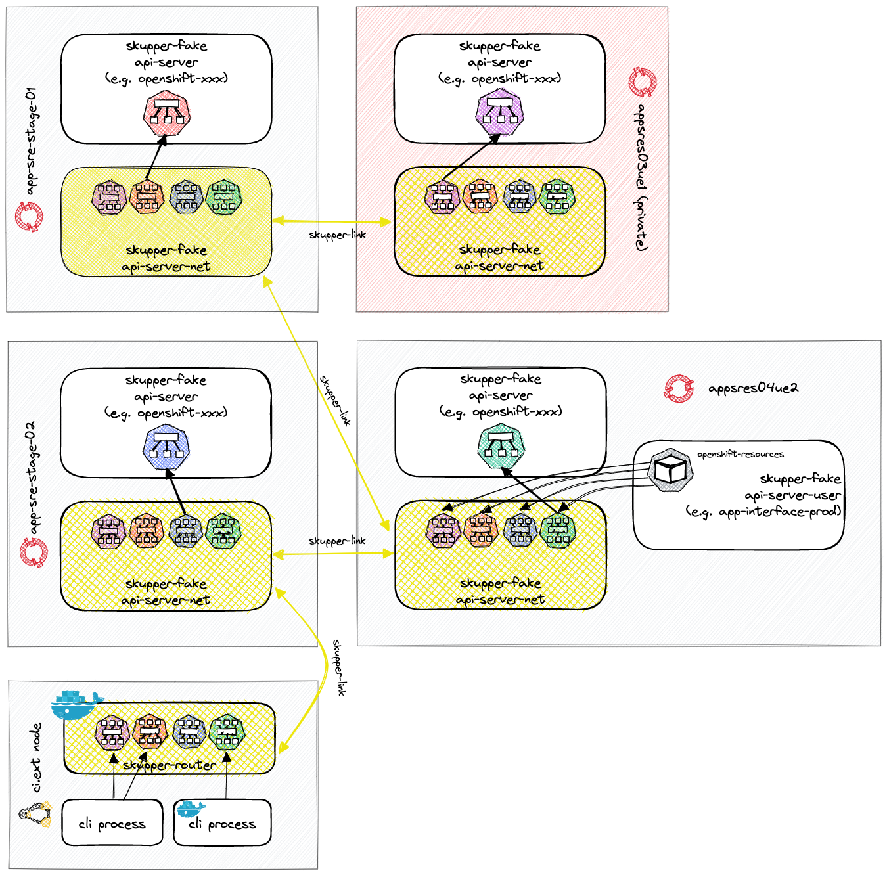

# Skupper Network
---

## Author/date
Christian Assing - September 2022

## Tracking JIRA
https://issues.redhat.com/browse/APPSRE-6122


## Problem Statement
There are many cases where cross-service connectivity is needed. When the services are collocated or accessible on the internet, this works. For other cases, we currently rely on AWS connectivity resources such as Peerings, Transit Gateways (TGW), and others.

This requires additional management of CIDR blocks so they don't collide, and thus planning and so on.
It also does not scale beyond a single cloud provider (AWS).
There are also questions being raised each time a workload hosted on a more or less 'public' VPC (e.g. ci.ext which worker nodes are not public) needs to reach internal services.


## Goal
The purpose of this POC is to show how Skupper networks could be deployed on our clusters to 'link' namespaces together and publish/consume services over that network.


## Skupper Introduction

[Skupper](skupper.io) is a layer 7 service interconnect. It enables secure communication across Kubernetes clusters with no VPNs or special firewall rules.

It allows spawning an 'application' network, abstracting the underlying network subtleties and letting apps connect by name and port. Once Skupper sites (namespaces) are interconnected, Skupper will route the traffic to wherever the service resides. It also provides load balancing/failover on all instances fulfilling the service.


* [Skupper Intro Video](https://www.youtube.com/watch?v=BZvd51ALPa8)
* [Skupper Overview](https://skupper.io/docs/overview/index.html)

A Skupper network could allow:
* Grafana to reach private clusters prometheus without peerings
* ci.ext node to reach Vault, hosted on a private cluster, without peerings
* Bastions/backplane - access to private clusters by authorized staff
* Cross-cloud service connectivity
* Qontract-reconcile integrations reaching remote/private clusters without peerings

### Features

* No changes to your existing application required
* No administrator privileges required
* Transparent HTTP/1.1, HTTP/2, gRPC, and TCP communication
* Communicate across clusters without exposing service ports on the internet
* Inter-cluster communication is secured by mutual TLS
* Dynamic load balancing based on service capacity
* Cost- and locality-aware traffic forwarding
* Redundant routes for high availability in the face of network failures


## Skupper Deployment

Skupper consists of 3 components (kubernetes deployments) which are deployed in a namespace without any administration permissions:

* **Site-Controller**
  * Deploys other Skupper components
  * Is an alternative to the [Skupper Operator](https://skupper.io/docs/operator/index.html)
  * Configured via `configmap/skupper-site`

* **Service-Controller**
  * Deployment created by **site-controller**
  * Monitors `Services`, `Deployments`, `Statefulsets`, and `Daemonsets` for skupper annoations
  * Creates and updates Skupper `Services`

* [**Router**](https://github.com/skupperproject/skupper-router)
  * Deployment created by **site-controller**
  * Is a high-performance, lightweight AMQP 1.0 message router.
  * This is the Skupper network


## POC Spike Architecture

Everything is deployed via [app-interface](https://gitlab.cee.redhat.com/service/app-interface/-/blob/222a8aa1/data/services/skupper-cassing/app.yml) without any admin permissions.
Connecting the Skupper sites was done manually.

### Use Case 1 - Vault

Showcase running a Vault instance on a private cluster and consuming it from everywhere.
See it in action via [Skupper Console](https://skupper-skupper-vault-net.apps.app-sre-stage-0.e9a2.p1.openshiftapps.com)


Namespaces:
  * *skupper-vault*:
    * Running a [fake vault HTTP application](http://github.com/chassing/http-stub).
    * This namespace is also a Skupper site and exposes the Vault service.
  * *skupper-vault-user*:
    * Not Skupper site and doesn't run any skupper related things
    * Running a fake Vault client (`curl`) and consuming exposed Vault service (from either *skupper-vault* or *skupper-vault-net* ) allowed via network policy
  * *skupper-vault-net*:
    * This namespace is a Skupper site and connected to another site
    * Exposes Vault service to local cluster granted via network policies
  * *skupper-router*
    * Not a namespace! It is a docker container running on a Linux box as part of the Skupper gateway
    * Exposes the Vault service on a port on the local machine
    * ```
      $ oc login $PUBLIC_CLUSTER
      $ skupper gateway init --type docker
      $ skupper gateway forward vault 8080
      ```
### Use Case 2 - OpenShift API Server

Showcase accessing OpenShift API servers running on public and private clusters from everywhere.
See it in action via [Skupper Console](https://skupper-skupper-fake-api-server-net.apps.app-sre-stage-0.e9a2.p1.openshiftapps.com)



Namespaces:
  * *skupper-fake-api-server*:
    * Running a [fake HTTP api-server](http://github.com/chassing/http-stub).
    * This namespace mimics the original openshift api-server namespace and doesn't host any Skupper components
  * *skupper-fake-api-server-net*:
    * Is a Skupper site and connected to other skupper sites.
    * Exposes a Skupper service which forwards to the local api-server, similar to [Service type externalName](https://kubernetes.io/docs/concepts/services-networking/service/#externalname)
  * *skupper-fake-api-server-user*:
    * Not Skupper site and doesn't run any skupper related things
    * Running a fake api-server consumer (`curl) and consuming exposed api-server services (from *skupper-fake-api-server-net* ) allowed via network policy
  * *skupper-router*
    * Not a namespace! It is a docker container running on a Linux box as part of the Skupper gateway
    * Exposes the api-server services on ports on the local machine
    * ```
      $ oc login $PUBLIC_CLUSTER
      $ skupper gateway init --type docker
      $ skupper gateway forward appsres03ue1 8080
      ```


## Troubleshooting

CLI:
* skupper debug events
* skupper network status
* skupper debug service appsres03ue1


via browser (Oauth!):
https://skupper-skupper-fake-api-server-net.apps.appsres04ue2.n4k3.p1.openshiftapps.com/DATA


## Limitations/Bugs/Notes

* A namespace can be part of exactly one skupper site. No overlapping skupper networks


* Service names must be unique in a Skupper network!
* `console-ingress: route` -> no Skupper console route
* Setting `ingress: route` site-controller creates route w/o restart
* reset router statistics: `oc rollout restart deploy/skupper-router`
* Router restart will interrupt Skupper services!!
* The router console doesn't display the consuming pod's origin namespace
* [No support](https://groups.google.com/g/skupper/c/YyGOHPj-5MA) for `DeploymentConfigs`, but can be used by annotating the service

## Open Topics

* HTTPS and certificate validation, see also [Skupper TLS with Prepopulated Certificates][skupper-prepopulated-Certificates]
* Protocols: tcp vs http vs http2
* router ingress: loadbalancer vs route

## Alternatives

* [Chisel](https://github.com/jpillora/chisel): a fast TCP/UDP tunnel, transported over HTTP, secured via SSH

## Links

* [Patricks Skupper Test](https://gitlab.cee.redhat.com/patmarti/skupper-tests/-/tree/main/)
* [Skupper Annotations](https://github.com/skupperproject/skupper/blob/master/api/types/types.go#L138-L141)
* [Skupper Documentation](https://skupper.netlify.app/skupper/latest/index.html)
* [Skupper Examples](https://skupper.io/examples/index.html)
* [Skupper Google Group](https://groups.google.com/g/skupper)
* [Skupper TLS with Prepopulated Certificates][skupper-prepopulated-Certificates]

[skupper-prepopulated-Certificates]: https://docs.google.com/document/d/1dtdyCkM_Mjhu0EiFVc7OWhztk4MINnoZwjOtnvBN85Q/edit#heading=h.4kh30u4x81mm
