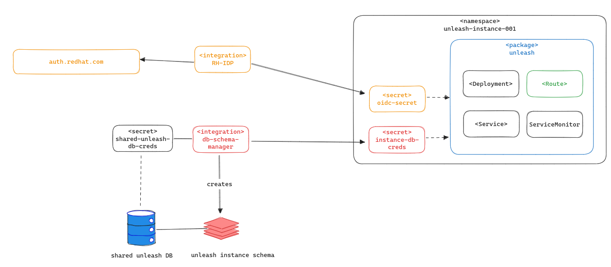

# Design doc: Unleash Capability Milestone 1

## Author/date

Gerd Oberlechner, Jan-Hendrik Boll / 2023-08

## Tracking JIRA

https://issues.redhat.com/browse/APPSRE-7902

## Problem Statement

We want to offer unleash as a capability, meaning we need a way to make it consumable by users that are not onboarded to app-sre.

A couple of challenges arise from this:

* Continuous delivery of unleash 
* Status reporting of unleash instances
* Database Management for unleash
* Authentication via Redhat SSO

## Goals

Define the design for the first iteration of unleash as a capability.

## Non-objectives

Specifying all the required technical details of the implementation. There might be follow-up design docs for that.

## Proposal

Teams can request an unleash instance for their consumption. We do not add an abstraction on top of unleash to manage i.e. the Feature Flags or Strategies. This is the responsibility of the customer. We do not intend to provide a shared instance. Every unleash instance requested should be used for a single application. It is upon the user to decide how to use it.

### Overview of the Milestone 1 architecture

Above's diagram shows the proposed architecture for the first iteration of the unleash capability:

* Use the app-interface commercial to implement this capability
* Deploy unleash using [Package Operator](https://gitlab.cee.redhat.com/lp-sre/package-operator)
  * Package Operator can report the status of unleash, which will be used in the next milestone
  * Use a SaaS file for continuous delivery of the unleash package
* Adapt RH-IDP for authentication
  * Create required SSO clients for the unleash instances and publish a secret for its usage
* All unleash instances should use a single, shared RDS instance
  * Each unleash instance should get its separate schema in the instance
  * Create a db-schema-manager integration to manage database schemas

## Alternatives considered

Creating a new app-interface, has many challenges, that would sidetrack this effort. We decided to take this on in the second iteration.

## Milestones

* [APPSRE-8134](https://issues.redhat.com/browse/APPSRE-8134) Create package operator package for deploying unleash
* [APPSRE-8132](https://issues.redhat.com/browse/APPSRE-8132) Adapt RH-IDP for authentication
* [APPSRE-8131](https://issues.redhat.com/browse/APPSRE-8131) Create a db-schema-manager
* [APPSRE-8140](https://issues.redhat.com/browse/APPSRE-8140) Make unleash ready for continuous delivery
