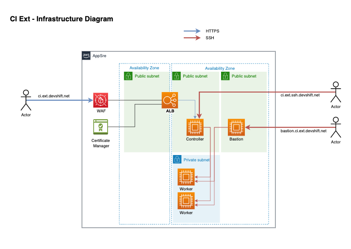

# Jenkins CI Ext Load Balancing / WAF

[TOC]

## Overview

The aim of this document is to expose to up-to-date frontend architecture for Jenkins ci.ext along with useful information.

## Architecture



## Load Balancing & WAF

The main access to jenkins is through an Application load balancer (ALB) secured by an AWS Web Application Firewall (WAF). This ensures that the Jenkins interface is protected against web application vulnerabilities such as Cross Site Scripting (XSS), SQL injections and other kind of attacks.

As we are securing a Jenkins controller, which has an adminisitration panel and we are using integrations to do the configuration, the WAF configuration could be a bit tricky as there are some rules that need to be allowed. As an example,
JJB do POST requests with large xml payloads to manage the job definitions. This could be detected as XSS an attack by the WAF if the pertinent rule is not disabled[1].

AWS provides a set of managed rule groups to protect backends against reported vulnerabilities such as OWASP's publications, known bad inputs, etc. Some of these rule groups are updated periodically with new definitions and the WAF will include them as soon as they are rolled out (latest version). This could possibly cause issues in the future if a new rule interfere with jenkins, so if at some point the number of blocked requests increases, it may be caused by a new rule definition.

On the ALB site, HTTPS is managed with the `ci.ext.devshift.net` certificate issued by Digicert. The certificate has been uploaded to Certificate Manager and is referenced in the ALB. **We will need to
update this certificate in Certificate Manager and in the Jenkins Controller when a new one is issued.**. There is a SOP under [Additional Resources](#additional-resources)

[1]. Rules are not disabled in AWS WAF, are set as ONLY_COUNT. This way rules just log the match but does not block the requests.

### Logging

WAF Logs are stored in `app-sre` Cloudwatch logs under `aws-waf-logs-ci-ext` loggroup. To monitor the BLOCKED requests or activity in general we can leverage `Cloudwatch log insights` to query the full loggroup. As an example, to filter all BLOCKED requests
go to `CloudWatchLogs -> Logs Insights`. Select the `aws-wag-logs-ci-ext` loggroup and do this query. Alternatively, the WAF Console have a Tab with the same functionality.

```text
fields @timestamp, @message
| filter @message like "BLOCK"
| sort @timestamp desc
| limit 20
```

### Access logging

Access logging can be enabled in the ALB if needed but are disabled by default.

### Observability

#### APP-SRE

- [WAF Dashboard](https://grafana.stage.devshift.net/d/G3iNMZynk/aws-web-application-firewall-waf-metrics?orgId=1&from=now-1h&to=now)
- [ALB Dashboard](https://grafana.app-sre.devshift.net/d/bt8qGKJZz/aws-elb-application-load-balancer?orgId=1&var-datasource=AWS+app-sre&var-region=default&var-loadbalancername=app%2Fci-ext-alb%2Fe5775b51976f95c8&from=1647604908421&to=1648209708421)

#### AWS

- WAF Rules have a Cloudwatch metric for every rule, in the WAF WebACL console, there is a chart with the WAF activity such as Counted_Requests, BlockedRequests etc per Rule.
- The ALB has the common load balancing metrics such as number of requests, status codes, etc. In the EC2 Console under Load balancers -> ci.ext

## Troubleshooting

The worst thing that could happen is that WAF blocks legit requests for some reason (new plugin, jenkins update, etc.). If that happens the WAF will return a 403 error to the client and a block will be logged
both in the logs and in the metrics. To solve that, the affected rule needs to be set as `Count only`. The terraform manifest has a local section with all the rules, uncomment the affected rule to set it as COUNT_ONLY
and do the terraform plan/apply.

It's important to say that some requests, e.g: AJAX calls, would just render a blank or a missing without no obvius indication of the error. Use the dashboards or the browser developer tools to catch the 403 errors in case
you need to diagnose problems.

## IaC Resources

All the components are managed as IaC with terraform [HERE](https://gitlab.cee.redhat.com/app-sre/infra/-/tree/master/terraform/app-sre/ci.ext-alb)

## Additional Resources

- [Digicert Certificates management SOP](https://gitlab.cee.redhat.com/service/app-interface/blob/master/docs/app-sre/sop/digicert-tls-certificates.md)
