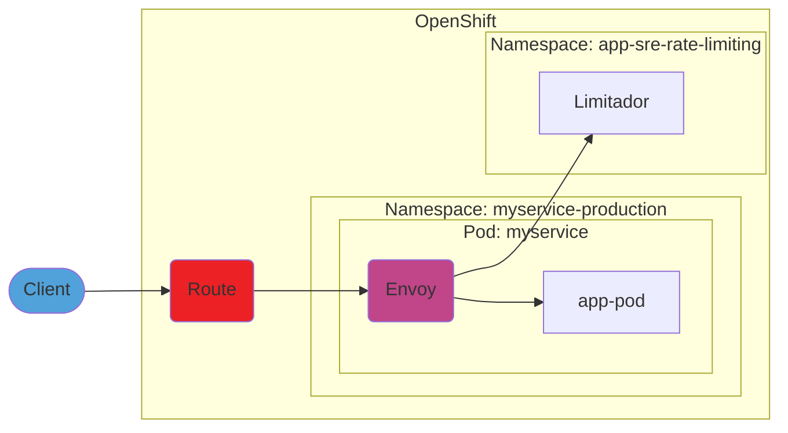

# Rate-limiting service

[TOC]

## Overview

AppSRE enables users to add rate-limiting capabilities in front of their HTTP services

Original rate-limiting for OCM presentation [slide deck](https://docs.google.com/presentation/d/10f-I_UIm3IwRNyJcixxzzScXSruLaTPRR51wn5ke-mA/edit?usp=sharing)

## Architecture

We deploy a single [limitador](https://github.com/Kuadrant/limitador) instance per cluster. All services using the rate-limiting service use this common limitador server service.

Envoy sidecar and rate-limiting templates can be found at: https://gitlab.cee.redhat.com/service/rate-limiting-templates

## Metrics and Dashboards

* [Rate-limiting dashboard](https://grafana.app-sre.devshift.net/d/rate-limiting/rate-limits?orgId=1)

## Troubleshooting
