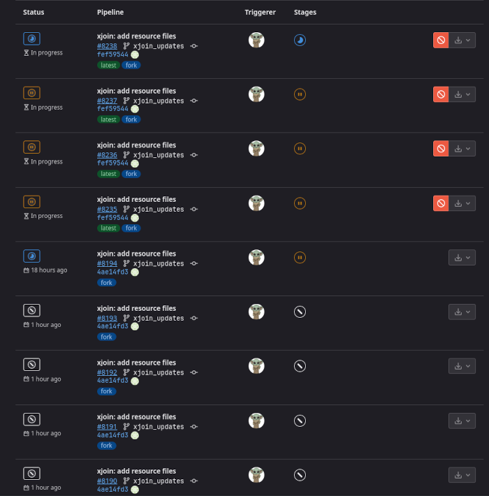

# Duplicate pipelines in GitLab

Sometimes you may see this odd behavior on App Interface or other 
[App Interface controlled repositories](https://gitlab.cee.redhat.com/service/app-interface#enable-gitlab-features-on-an-app-interface-controlled-gitlab-repository)
where there are duplicated pipelines in a pending state. 
This can halt automatic merges by the bot and cause other issues with PRs.

## Root Cause
Network connectivity or API issues on the GitLab end may cause the 
[qontract-reconcile-jenkins-webhook integration](/data/integrations/qontract-reconcile-jenkins-webhooks.yml)
to be unable to fetch the existing state of webhooks from GitLab, resulting
in the integration creating duplicate webhooks which leads to those pending pipelines in the UI.

## Fix
Run the [webhook-cleaner integration](/data/integrations/qontract-reconcile-jenkins-webhooks-cleaner.yml) manually.
Do this by first logging into the cluster which hosts our QR integrations (appsrep05ue1 in commercial) via CLI and switching to the "app-interface-production" project.
Then run this command with OC:

`oc create job --from=cronjob/qontract-reconcile-jenkins-webhooks-cleaner <descriptive_name_here>`

This will then trigger a manual run of the webhook cleanup job which should remove the duplicate
webhooks from any App Interface controlled projects.
