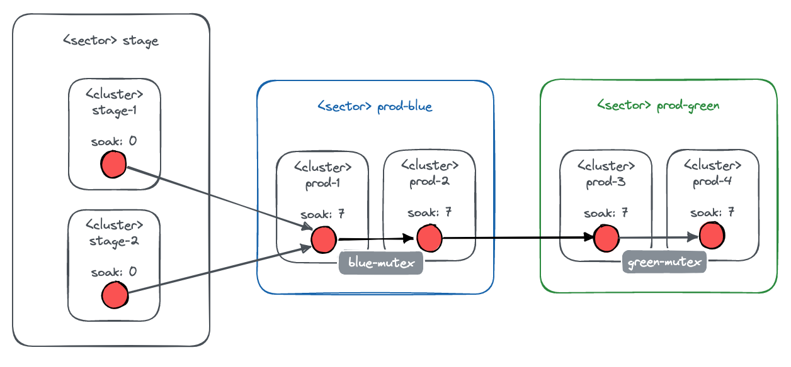

# Declare Advanced Upgrade Service for SRE capabilities users

## Motivation

AppSRE manages a fleet of clusters with various workloads and various constraints on how these clusters continously receive Openshift updates. Years of experience, high automation and strong tooling allowed AppSRE to turn cluster upgrades into a no-toil process.

The Advanced Upgrade Service (AUS) SRE capability provides the same powerful policy based  upgrade experience for any cluster in <https://console.redhat.com/openshift>

## Concepts

AUS revolves around the concepts of `workloads` and `conditions` for upgrades.

The most central condition is `soak days`, which defines the number of days an Openshift version should run on other clusters with similar `workloads` before it is considered to be applied to a cluster.

> There needs to be at least one cluster with 0 `soak days` to start the process

Another widely used condition is `mutexes`. A `mutex` acts as an exclusive lock a cluster must aquire before an upgrade is applied. This way, one-cluster-at-a-time semantics can be achieved for upgrades.

Clusters can also be partitioned into `sectors`, e.g. stage and production. Updates are applied to all clusters of a sector before it is considered for a dependant sector, e.g. first stage then production.

## Requirements engineering

Before an upgrade policy can be defined, the requirements and constraints for cluster upgrades need to be elaborated with the tenant. Since AppSRE is going to create the policy in `app-interface` in most cases (see [Support model](#support-model)), proper discussion about the update requirements is crucial.

## Defining a policy

After an OCM organization has been [onboarded](/docs/app-sre/sop/onboard-ocm-organisation.md) into `app-interface`, all configuration for upgrade policies are defined in that organization file.

### Define clusters, workloads and soakdays

AUS (in the scope of SRE capabilities) does not onboard clusters as `/openshift/cluster-1.yml` files but declares them as part of the OCM organization file under `upgradePolicyClusters`.

Lets define a simple cluster upgrade configuration where a stage cluster immeditely picks up new versions and two production clusters follow after 7 days.

```yaml
upgradePolicyClusters:
- name: stage-1 (1)
  upgradePolicy:
    workloads:
    - my-service (2)
    schedule: 0 13 * * 1-5 (3)
    conditions:
      soakDays: 0 (4)
- name: prod-1
  upgradePolicy:
    workloads:
    - my-service (5)
    schedule: 0 13 * * 1-5 (3)
    conditions:
      soakDays: 7 (6)
- name: prod-2
  upgradePolicy:
    workloads:
    - my-service
    schedule: 0 20 * * 1-5 (3)
    conditions:
      soakDays: 7
```

(1) The name of the cluster must match the cluster name in OCM (on <https://console.redhat.com/openshift>)

(2) The cluster runs a workload we name my-service

(3) Cluster upgrades are only started during this period

(4) A new Openshift version is immedately considered to be applied. Each workload need at least one cluster with 0 `soak days`

(5) The production cluster defines the same workloads...

(6) ... so it waits for a version to soak for 7 days on the stage cluster

All workload identifiers that are used while defining clusters, must also be declared in the organization file under `upgradePolicyAllowedWorkloads`.

```yaml
upgradePolicyAllowedWorkloads:
- my-service
```

### Define mutexes

In the previous example, different `schedules` were used for the production clusters so that upgrades would not run concurrently. A better and safer way to achieve that is a `mutex`.

```yaml
...
- name: prod-1
  upgradePolicy:
    ...
    conditions:
      mutexes:
      - prod
- name: prod-2
  upgradePolicy:
    ...
    conditions:
      mutexes:
      - prod
```

Now both production clusters define the same mutex and only one of them can be upgraded at the same time.

All mutex identifiers that are used while defining clusters, must also be declared in the organization file under `upgradePolicyAllowedMutexes`.

```yaml
upgradePolicyAllowedMutexes:
- prod
```

### Defining sectors

Additionally, clusters can be grouped in sectors. A version needs to be applied to all clusters of a sectors before it is considered for a dependant sector.

In this example, updates progress from the `stage` sector to the `prod-blue` sector and then to the `prod-green` sector. Mutexes are in place in the prod sectors to prevent more than one cluster to be upgraded at the same time.



```yaml
upgradePolicyClusters:
- name: stage-1
  upgradePolicy:
    ...
    conditions:
      sector: stage
- name: stage-2
  upgradePolicy:
    ...
    conditions:
      sector: stage
- name: prod-1
  upgradePolicy:
    ...
    conditions:
      soakDays: 7
      sector: prod-blue
      mutexes:
      - blue-mutex
- name: prod-2
  upgradePolicy:
    ...
    conditions:
      soakDays: 7
      sector: prod-blue
      mutexes:
      - blue-mutex
- name: prod-3
  upgradePolicy:
    ...
    conditions:
      soakDays: 7
      sector: prod-green
      mutexes:
      - green-mutex
- name: prod-4
  upgradePolicy:
    ...
    conditions:
      soakDays: 7
      sector: prod-green
      mutexes:
      - green-mutex
```

Sectors and their dependencies are defines in the `sectors` section of the organization file.

```yaml
sectors:
- name: stage
- name: prod-blue
  dependencies:
  - name: stage
- name: prod-green
  dependencies:
  - name: prod-blue
```

### Blocking versions

AUS can be told to ignore certain versions or version ranges to prevent them from being applied to clusters, e.g. ignore all release candidates.

```yaml
blockedVersions:
- ^.*-rc\..*$
```

## Support model
