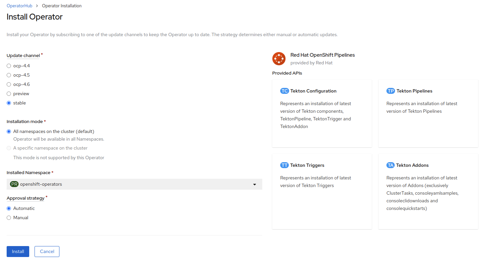
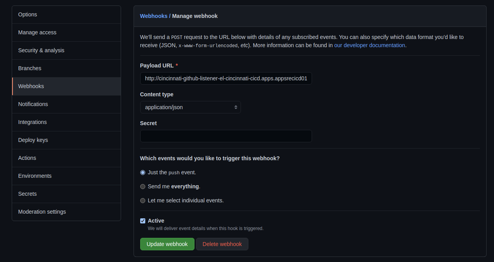

# app-sre tekton CI/CD proposal
Reference ticket [APPSRE-3183](https://issues.redhat.com/browse/APPSRE-3183)
## Overview
Overview as part of this proof of concept I took cincinnati and hive as example applications CI/CD workflows.  
In these two cases we are building images and pushing them to quay.io and are triggered by a push to the upstream github repos.  

## Prerequisites 

* github repository that has the dockerfile to build images.
* Red Hat OpenShift Pipelines Operator installed from OperatorHub to all namespaces on the cluster (currently can't select individual namespaces)
* quay.io organization and repository
 * Image pull secret to pull/push images to quay.io
 * Image pull secret stored in an OpenShift cluster (examples use secret name regcreds)
   * Secret is mounted for tasks and the pipeline
###  OpenShift Pipelines Operator (Tekton)




#### Post operator installation
Once the Operator is installed you need to run the following command for the pipeline service account

```sh
oc adm policy add-scc-to-user -n <project-namespace> anyuid -z pipeline
```

## Triggers

Triggers have several components and a corresponding webhook has to be setup for github to trigger.

* TriggerBinding - binds repo variables to parameters
* TriggerTemplate - similar to a pipelinerun to feed parameters to the pipeline
* Trigger - integrates TriggerBindings to TriggerTemplates
* EventListener - listens for events from github
* Route - used for the github webhook in the repository
  * ex. http://cincinnati-github-listener-el-cincinnati-cicd.apps.appsrecicd01.gqeo.s1.devshift.org/



## Example applications

The pipelines below are very similar. The `build-deploy` task populates some environment variables and just call a specific script from the repo to do the build and deploy the images to quay.io that is needed for the applications. In fact you can just do a sed command to change all the project names in the file. 

ex. `find . -print | grep yaml | xargs -I{} sed -i 's/hive/cincinnati/g' {}`

All CRs can be loaded with `oc -n <namespace> create -f <path to file>`

The environment variables that are setup for the repository scripts are as follows:

```sh
Base Image Name: $BASE_IMG
Quay Image Name: $QUAY_IMG
Git Full Hash: $FULL_GIT_HASH
Git Short Hash: $GIT_HASH
Dockerfile Path: $DOCKERFILE_CONTEXT_DIR
SSL verify: $SSL_VERIFY
```
These values come from the pipeline/task parameters

I created the `app_sre_buildah_deploy.sh` script in my fork on the tekton branch. Direct links are below.

_Note: Pipelineruns will start a new pipeline manually_https://docs.google.com/document/d/1gR45KzTnjtj_qJTWsRAhswjoSV8MjvF7A-aV7E03XEQ/edit

### Cincinnati
[Cincinnati pipelines/tasks, pipelineruns, triggers](https://github.com/continuous-devops/pipelines-tutorial/tree/master/cincinnati/cicd)

[./dist/app_sre_buildah_deploy.sh](https://github.com/arilivigni/cincinnati/blob/tekton/dist/app_sre_buildah_deploy.sh)

### Hive
[Hive pipelines/tasks, pipelineruns, triggers](https://github.com/continuous-devops/pipelines-tutorial/tree/master/hive/cicd)

[./hack/app_sre_buildah_deploy.sh](https://github.com/arilivigni/hive/blob/tekton/hack/app_sre_buildah_deploy.sh)


_note: The hive pipeline is really not complete since it creates a catalog at the end that requires internal access_
