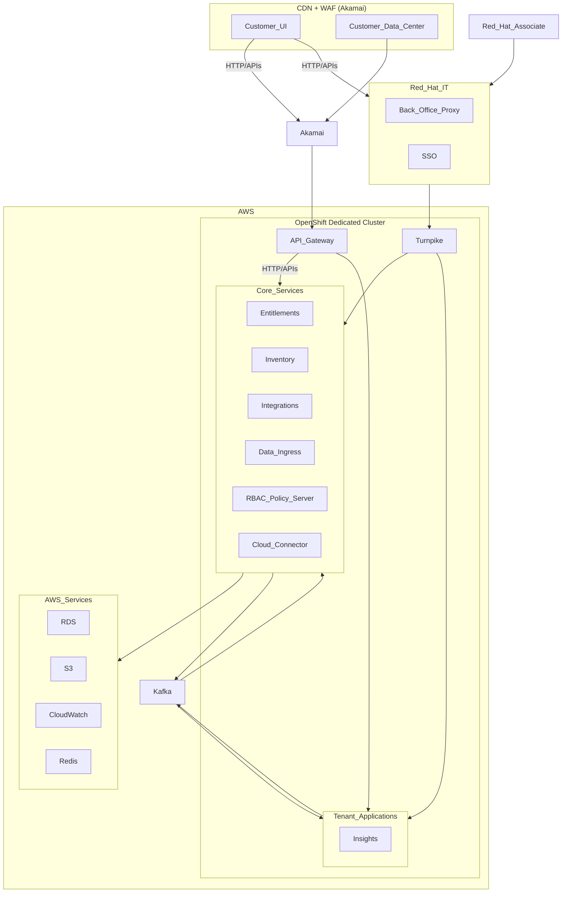

# console.redhat.com (Insights)

## Service Description
A set of cloud based management applications. A set of microservices running in an OpenShift cluster. Microservices are exposed externally via an API Gateway. Internal intra-service communication over Kafka message broker as well as directly over HTTP APIs. Microservices use AWS for data storage (RDS, S3, Redis, CloudWatch).

## Components

### Akamai
[Akamai](https://www.akamai.com/) provides a CDN and WAF capability that fronts much of the traffic for console.redhat.com.  Akamai hosts the static web content, proxies data to the API Gateway (3Scale), performs rate limiting capabilities, is used for MQTT communication and WSS communications on the platform.

### Red Hat IT
Red Hat IT hosts a variety of servies from Single sign-on (external and internal). Back office data that supplies customers entitlements based on SKUs, the user registry, some email facilities, and more.

### API Gateway (3Scale)
The API Gateway performs TLS termination for all requests coming to console.redhat.com/api or cert.console.redhat.com/api and routes API calls to the appropriate Kubernetes service on the OpenShift Dedicated cluster. Beyond routing 3Scale also supplies a global API timeout and associated metrics gathering helpful for error and latency reporting within the platform. Service to service communication doesn't go through the API Gateway.

### Kafka
Beyond HTTP communication services/applications on the OpenShift cluster utilize Kafka as the message queue component for communication. Utilizing a variety to topics and producers and consumers to send the data.

### Entitlements
This service is utilized to check whether a user in a Red Hat organization has a specific entitlement. This service exposes and API that gathers this information from Red Hat IT's Back Office.

### Host Based Inventory
A managed inventory of all RHEL systems that are managed from the cloud or on-premises. This service stores a variety of system profile data information including tags and attributes/facts. This service is heavily used by Insights service applications (Advisor, Drift, Vulnerability, Compliance, Malware, Remediations, etc). The data from this service is synchronized to these services so they can connect their content/context specific information about that host.

### Cloud Connector
A component to enable execution of playbooks from the Cloud. Integrated with Remediations and Integrations (Sources) components. Based on MQTT protocol and supports direct connect systems without Satellite through [rhc](https://access.redhat.com/articles/rhc) and with Satellite, utilizing the broker in Akamai currently.

### Integrations (Sources)
A credential vault to allow applications on the platform to import data from or communicate with external APIs.

### RBAC Policy Server
Implemented as microservice on the platform, with a REST  API and UI.
Uses familiar and standard RBAC concepts:

- Roles: A set of permissions that provide access to a given service.
- Permission:  A discrete action that can be requested of a service. Permissions are assigned to roles.
- Group: A collection of users belonging to an account which provides the mapping of roles to users.
User access is controlled by assigning appropriate roles to the groups they belong to.
- Principal: an authenticated user/subject

Each application must define its permissions and implement corresponding access control logic

### Data Ingress
Data is uploaded via the Ingress service REST API. Ingress service uses S3 buckets to temporarily store uploaded data. Data availability is announced using Kafka via a predefined topic and header matching the uploaded data. Uploaded data type is encoded in HTTP MIME  type (e.g. for type “advisor”, announced on topic “platform.upload.advisor”:
curl -vvv -F "file=@test-archive.tar.gz;type=application/vnd.redhat.advisor.test+tgz" -u test:test https:/cloud.redhat.com/api/ingress/v1/upload).

### Turnpike
An alternative gateway using Red Hat Internal SSO and PKI infrastructure. Designed to allow Red Hat associates to access management APIs on the platform. Turnpike comes with its own authorization framework to control access, it can use LDAP group membership from Red Hat Rover.

### Insights
Insights is a set of applications running on console.redhat.com providing information, alerts, actions for RHEL and OpenShift platforms.

## Deployment

### Clowder
Many of services deployed on console.redhat.com utilize Clowder for deployment. Clowder is an operator that creates deployments and seeds these deployments with secrets from app-interface and the AppSRE Vault service. The information provided covers AWS integrations like RDS, S3, IAM service accounts, and CloudWatch. It also include Vault secrets like preshared keys for service to service commmunication.

### Frontend-Operator
The static content creating the single page applications on console.redhat.com are hosted by containers operated by the frontend operator that opens routes for Akamai to pull source from to warm its CDN cache. Containers are deployed into beta and stable workspaces.

