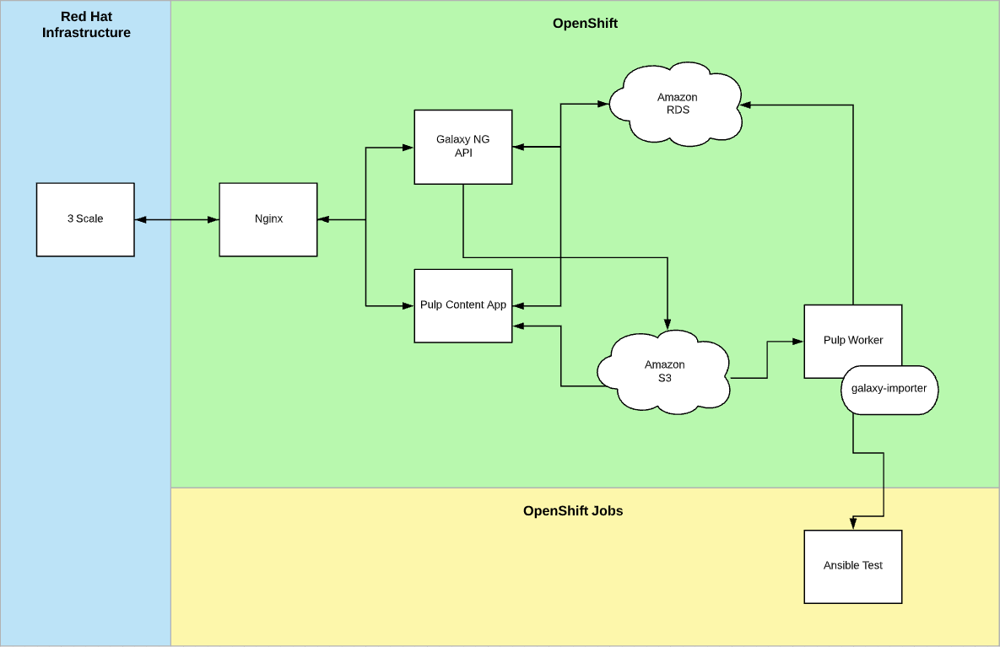

# Automation Hub Architecture

## Service Description: 
Automation Hub is a Red Hat Ansible Automation Platform service hosted on console.redhat.com that provides a portal for Ansible Automation subscribers to search for and access Ansible Content Collections supported by Red Hat and Ansible Partners via the Certified Partner Program.

## Components: 
### nginx (automation-hub-backend)
The public web component that proxies traffic to the api and content-app and implements traffic controls like upload size limits. 

The service will be down if nginx is not available.

### api (automation-hub-galaxy-api)
The main component that processes all API requests from the user interface or customer. 

The service will be down if the api is not available.

### content-app (automation-hub-pulp-content-app)
Processes download requests and returns the S3 endpoint to the requested content.

Content downloads will fail if the content-app is not available.

### worker (automation-hub-pulp-worker)
Processes asynchronous system tasks including handling new content uploads, approvals, and migrations between repositories.

Content cannot be managed if the workers are not available.

### ansible-test 
Performs tests and linting on content uploads. 

This is not a long running service. These jobs are only run during content uploads.

## Routes: 
* https://console.redhat.com/ansible/automation-hub
* https://console.redhat.com/api/automation-hub

## Dependencies: 

### Internal Dependencies
* 3scale for ingress/API management
* RedHat SSO for authentication/authorization

### External Dependencies
* Amazon RDS database
* Amazon S3 for content storage

## Service Diagram: 

[Automation Hub Architecture Overview](https://docs.google.com/document/d/1xoJJnlbZVyPPzupfG7yFnb8ahByo9X06UY6qmKYPhIs/edit#heading=h.txcy30lu82yc)

## Application Success Criteria: 
Red Hat will endeavor, with best intentions, to have Automation Hub available at all times meeting the SLA. Maintenance at times may require the service to become unavailable for a period of time, Red Hat will notify users of any intended outage.

## State: 
####  Amazon RDS 
RDS is used to maintain persistence, storing data on all the collections, namespaces, and repositories.

If the database is not available, then all API requests will fail.

#### Amazon S3 
S3 is used for content storage.

If S3 is not available then content downloads will fail.

## Load Testing: 
The service has been evaluated and tested by RH Performance and Scale team:\
https://docs.google.com/document/d/14bSeSutPJjHrV-aDeDQkXjMvQbAKUXmqFfJMig_uE3I/

## Capacity: 
This capacity is expected to handle current and future workloads. If traffic increases, only the API will need an increase in replicas.

#### nginx (automation-hub-backend)
* 3 pods
* 200m CPU
* 128Mi memory

#### api (automation-hub-galaxy-api)
* 3 pods
* 1 CPU
* 2Gi memory

#### content-app (automation-hub-pulp-content-app)
* 3 pods
* 1 CPU
* 1536Mi memory

#### worker (automation-hub-pulp-worker)
* 6 pods
* 500m CPU
* 512Mi memory
