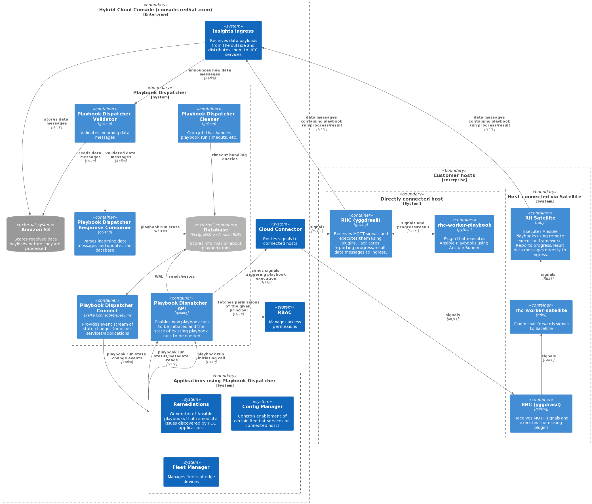

# Playbook Dispatcher architecture

## Service Description

Playbook Dispatcher is a service for running Ansible Playbooks on hosts connected via [Cloud Connector](https://github.com/RedHatInsights/cloud-connector).

Playbook Dispatcher takes care of:

- dispatching the request to run a Playbook
- tracking the progress of a Playbook run

## Service Diagram

## Components

Playbook Dispatcher is broken down into the following components:
* Playbook Dispatcher API
  * Internal API
  * External API
* Playbook Dispatcher Validator
* Playbook Dispatcher Response Consumer
* Playbook Dispatcher Connect
* Playbook Dispatcher Cleaner

Proper functioning of all components are necessary to meet the service goals of Playbook Dispatcher.

### Internal API

The internal API allows for an Ansible playbook to be dispatched to a given recipient.
This process consists of:

1. Authentication of the caller using PSK
2. Validation of input parameters
3. Transformation of the input parameters into a message that the specific Ansible executor understands
4. Sending the message to the connected host using Cloud Connector service
5. Persisting the playbook run information in the database.

Based on the input parameters and the type of recipient, Playbook Dispatcher chooses the [appropriate message format](https://github.com/RedHatInsights/playbook-dispatcher#cloud-connector-integration) and sends it to the given recipient using the Cloud Connector service.
Note that the Ansible playbook itself is not sent in the data message.
Instead, the URL of the playbook to be executed is sent in the message.
The recipient (rhcd or Satellite) retrieves the playbook using this URL.

A new database record is created for each successfully dispatched playbook run.

Moreover, the internal API provides the following additional operations:
* connection status - allows other services to determine whether a given recipient is connected or not
* playbook run cancelation - allows a service to cancel a previously dispatched playbook

### External API
The external API provides a read-only view on the playbook runs.
The API operates with two main types of resources:

1. playbook run - a playbook that was sent to a given recipient
2. host - a connected hosts that is part of a playbook run. A playbook run may involve 1 or more hosts.

The external API allows the information about playbook runs and hosts to be obtained.
This includes status (per host, overall playbook run status), console output produced by the given playbook run and metadata.
Access to resources is subject to authorization.
Authorization policies are stored in the Insights RBAC service and enforced by the Playbook Dispatcher API component.

The external API is exposed using the 3scale web gateway.
As a result, it can be queried directly from HCC frontend code, from customer scripts, etc.
In addition, HCC services can query the external API directly.

The external API is collocated with the internal API (deployed in the same pod/container)

### Validator

The response validator component validates the data messages coming from the connected hosts.

The component listens for new upload announcements produced by the Insights Ingress service.
Based on these, the response validator fetches the uploaded archive from its location (S3 bucket), decompresses it, determines the type of events contained in the archive and matches them against a JSON schema.

Afterwards, the validated events are sent to the response consumer for further processing.

### Response Consumer

The response consumer component processes the data messages sent from connected hosts.
It operates on data already validated by the response validator.
Response consumer uses this data to determine:

1. status of individual hosts
2. overall playbook run status
3. console output of each host
4. additional information about the playbook run (e.g. which tasks failed, succeeded, etc.)

This information is correlated with the records stored in the database and the records are updated based on the processed data.

### Connect (event interface)

In addition to the external REST API, an asynchronous [event interface](https://github.com/RedHatInsights/playbook-dispatcher#event-interface) is available.
This interface is provided by the connect component.
The interface allows HCC services to consume playbook dispatcher state changes asynchronously, using Kafka.

The event interface is provided by a dedicated Kafka Connect (AMQ Streams) instance running a [Debezium](https://debezium.io/) connector.
The connector reads the write-ahead log of the database and turns it into a Kafka event stream.
A [custom transformation](https://github.com/RedHatInsights/playbook-dispatcher/tree/master/event-streams) is plugged in to transform the events into a desired event format.

### Cleaner

A simple cronjob that handles plabook run timeouts.

## Routes

### Internal API Routes

The Internal API exposes the following routes:
* `/internal/dispatch` - Dispatches Playbooks using Cloud Connector and stores corresponding run records.
* `/internal/version` - Indicates the git revision the API was built from.
* `/internal/v2/dispatch` - Dispatches Playbooks using Cloud Connector and stores corresponding run records.
* `/internal/v2/recipients/status` - Obtains connection status of recipient(s)
* `/internal/v2/cancel` - Cancels Playbook Runs using Cloud Connector
* `/internal/v2/connection_status` - Obtains Connection Status of recipient(s) based on a list of host IDs. Reaches out to the Inventory and Sources API to determine connection status.

### External API Routes

The External API exposes the following routes:
* `/api/playbook-dispatcher/v1/runs` - Returns a list of Playbook runs for the given account.
* `/api/playbook-dispatcher/v1/run_hosts` - Returns a list of objects representing hosts involved in Playbook runs.

More information about theses routes can be found on the OpenAPI specification of the [Internal](https://github.com/RedHatInsights/playbook-dispatcher/blob/master/schema/private.openapi.yaml) and [External](https://github.com/RedHatInsights/playbook-dispatcher/blob/master/schema/public.openapi.yaml) APIs.

## Dependencies

[Cloud Connector service](https://github.com/RedHatInsights/cloud-connector) - a HCC platform service that enables signals to be sent from HCC to connected hosts. The service uses the Akamai MQTT broker which relays the signals. In addition, this service populates host inventory with information about connected hosts as well as keeps track of the connection state of the connected hosts.

[Ingress service](https://consoledot.pages.redhat.com/docs/dev/services/ingress.html) - a HCC platform service that receives data payloads from the outside and distributes them to HCC services.

[Host Base Inventory](https://consoledot.pages.redhat.com/docs/dev/services/inventory.html) - A service that is the source of truth for system, or host, information across the entire platform. Playbook Dispatcher uses this API to determine connection status for recipients.

[Sources API](https://consoledot.pages.redhat.com/docs/dev/services/sources/sources.html) - An API that provides a standardized way to store cloud provider credentials used by several application teams in the cloud.redhat.com organization. Playbook Dispatcher uses this service to determine the connection status of satellite recipients.

[Insights RBAC](https://github.com/RedHatInsights/insights-rbac) - stores authorization role and policy information.

Kafka - used for communication with other services within the HCC platform.

3scale web gateway - routes external HTTP requests to Playbook Dispatcher. Handles authentication.

Amazon RDS for PostgreSQL - used to persist records for playbook run and host information.

All dependencies need to be available for Playbook Dispatcher to work as expected.

## Application Success Criteria

* Customers can use RHC with minimal downtime of playbook dispatcher to complete tasks
* Eventually all RHEL customers that use Red Hat connector with RHEL 8.5+ will use Playbook Dispatcher to dispatch playbook run requests
* We expect at least 90% uptime for the service
* [Business Continuity Plan](https://docs.google.com/document/d/1R_pdjracS3kws6K8ToNv6B3EGfma_pajXuiDXFJqaEA/edit#heading=h.xf6qf1tckbkj)
* [Engineering escalation policy](https://gitlab.cee.redhat.com/service/app-interface/-/blob/master/data/teams/insights/escalation-policies/crc-pipeline-escalations.yml)

## State

Playbook Dispatcher requires the Amazon RDS for PostgresSQL and the Kafka message queue. Without these components, Playbook Dispatcher will not fulfill its objectives.

## Load Testing

Load tests were conducted as part of [RHCLOUD-27541](https://issues.redhat.com/browse/RHCLOUD-27541).
The tests can be re-run using [this guide](https://gitlab.cee.redhat.com/service/app-interface/-/blob/master/docs/console.redhat.com/app-sops/playbook-dispatcher/playbook-dispatcher-load-testing.md).

## Capacity

The current and future CPU and Memory capacity limits for all components, except for Playbook Dispatcher Connect, is as follows:
* CPU - 500m
* Memory - 512Mi

For Playbook Dispatcher Connect the limit is set to the following:
* CPU - 1
* Memory - 4Gi
