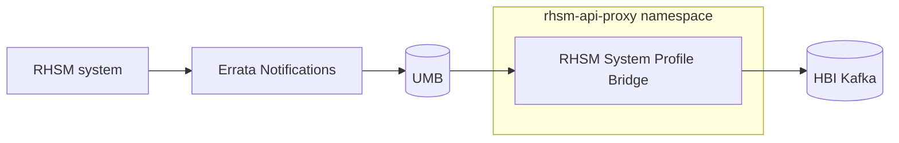

# RHSM System Profile Bridge

RHSM System Profile Bridge ("Bridge" for short) is a messaging bridge that connects the UMB (Unified Message Bus) to the HBI (Host-Based Inventory) Kafka cluster.

## Motivation

Red Hat is centralizing the management experience in console.redhat.com, but many customers' systems are registered with RHSM. To let RHSM users participate in the console-dot experience, we need to send a copy of every system profile sent to Errata Notifications (an RHSM service) to the Host-Based Inventory (HBI) as well.

To "send a copy" of system profiles to HBI means to publish a JSON message to the HBI Kafka cluster's platform.inventory.host-ingress topic. However, the HBI Kafka cluster is not accessible from services running outside console.redhat.com environments like Errata Notifications, so Errata cannot publish messages directly to Kafka. 

Instead, Errata integrates with the Unified Message Bus (UMB), an ActiveMQ Classic broker cluster accessible by both Errata Notifications and services running within the console.redhat.com environments. The role of RHSM-System-Profile-Bridge is sit inside the console.redhat.com network and forward messages from UMB to the Kafka cluster, letting Errata Notifications send a copy of system profiles over to HBI. As a result, RHSM customers can use services like Patch to assess system vulnerabilities.

## Overview

Bridge is deployed to console.redhat.com environments. It consumes from the UMB crc.bridge.platform.inventory.host-ingress virtual topic and produces to the platform.inventory.host-ingress Kafka topic. As a result, messages produced by Errata Notifications are forwarded to HBI and RHSM systems appear in the console-dot inventory.

## Where does data live

All data originates from customer systems, which send new or modified system profile JSON messages to Errata Notifications at most once every four hours by default. The latest version of every system profile is stored durably in the Errata Notifications C3 MongoDB cluster. Each HBI-formatted system profile message that Errata publishes is also stored durably within UMB until Bridge ACK's the message, at which point the message is now stored within the Kafka cluster.

## Backup policies and schedules

Bridge sends messages to the platform.inventory.host-ingress topic, whose replication factor is defined [here](https://github.com/RedHatInsights/platform-mq/blob/master/helm/kafka-topics/values.yaml#L240) in the platform-mq project.

Errata Notifications sends messages to Bridge via UMB, which persists all messages until they are consumed in a [MariaDB cluster](https://source.redhat.com/groups/public/enterprise-services-platform/it_platform_wiki/umb_appendix#message-persistence-mariadb). The cluster is managed by IT-DBA, whose policies may be found [here](https://source.redhat.com/groups/public/gcadba/it_database_service_dba_wiki/it_dba_service_offering_aurora_mysqlrds_mariadb)

Errata Notifications' system profiles are stored in a MongoDB cluster managed by IT-DBA. Their policies may be found [here](https://source.redhat.com/groups/public/gcadba/it_database_service_dba_wiki/it_dba_service_offering_mongodb). The current backup status of the c3mongodb instances may be found [here](https://dbutil01.dba-001.prod.iad2.dc.redhat.com/backup_status_mongodb.html).

## Impacts of data loss

If Bridge fails to deliver a system profile for any reason, UMB will re-deliver the dropped update. This has no impacts beyond marginally increased latency between when a profile is uploaded to RHSM and when hosts are updated in HBI.

If the UMB loses an HBI update message, then the console.redhat.com system inventory may not reflect the most up-to-date state of a customer's system, and the Patch/Vulnerability data for that system may be inaccurate or missing. The problem would be resolved the next time the impacted system(s) push an update to Errata Notifications, which would then deliver a new HBI update to UMB.

Loss of system profile data in Errata Notifications could have the same consequences, since updates may not be published to UMB. Data would be restored the next time a customer system checks-in with Errata Notifications.

## Service dependencies

Bridge depends directly on the Kafka cluster and on the UMB cluster. It depends indirectly on Errata Notifications, which publishes HBI update messages to UMB.

## Technology Stack

Bridge is a Java application built with Quarkus and Smallrye Messaging, which provides Kafka (HBI) and ActiveMQ Classic (UMB) integration. Bridge captures metrics using Micrometer, which are exposed over the API to Prometheus. We push logging events to the enterprise Splunk instance using the HEC API.

For more information, refer to the [wiki](https://gitlab.cee.redhat.com/rhsm/rhsm-system-profile-bridge/-/wikis/Tech-Stack).
