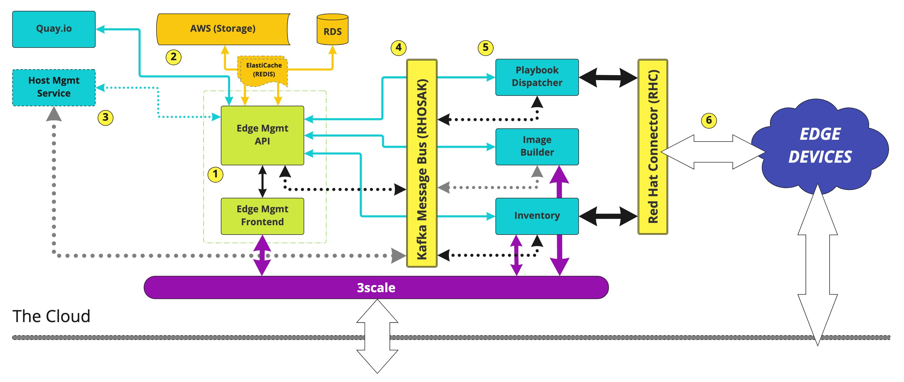
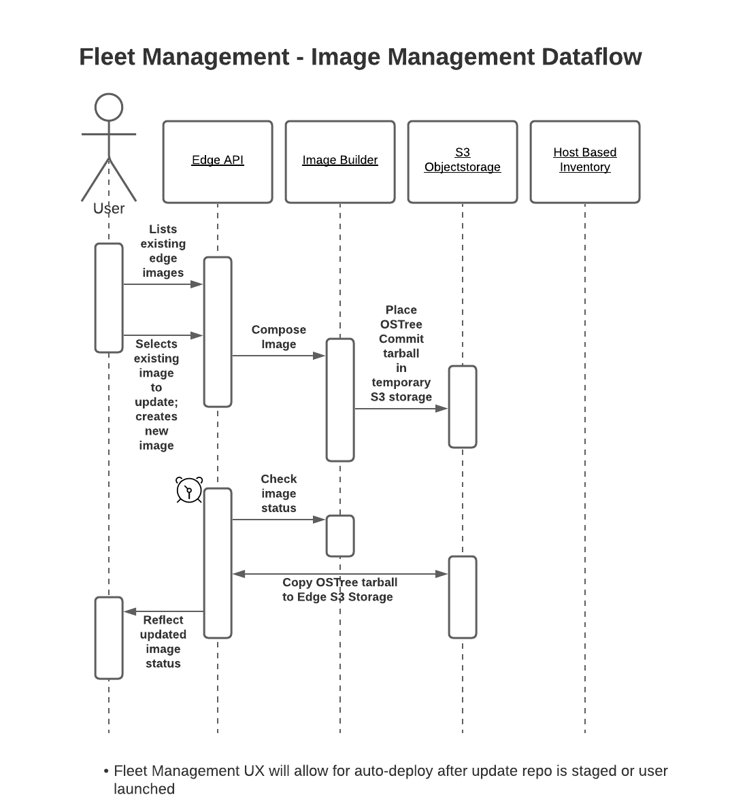
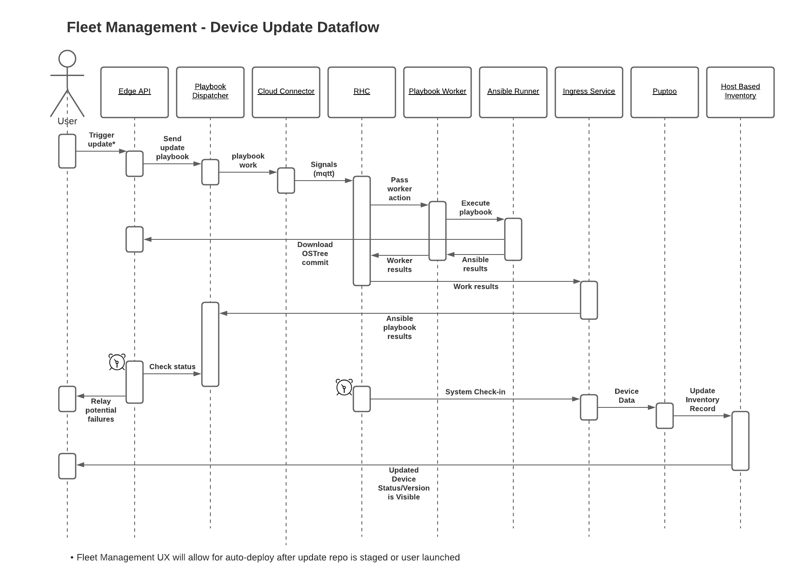
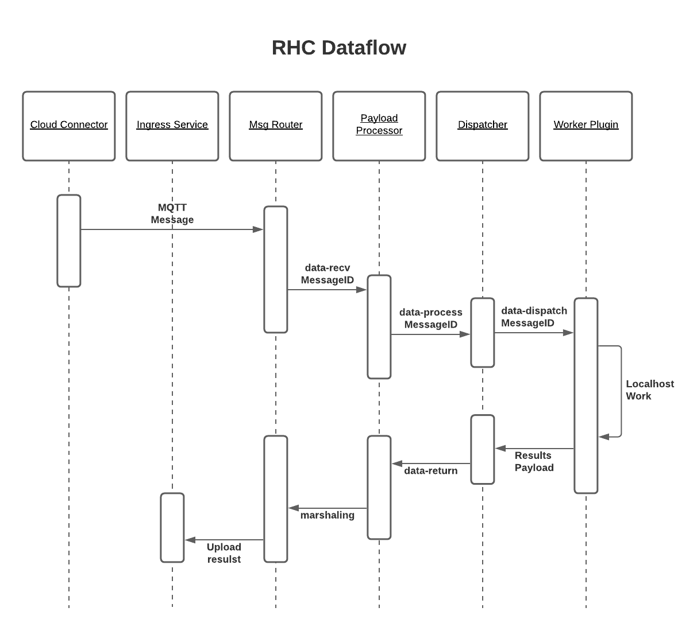
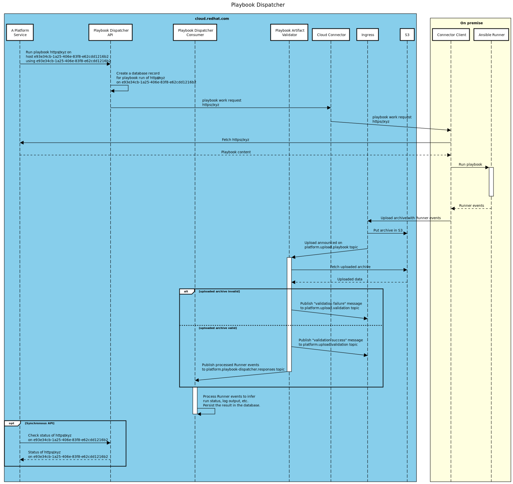

# Architecture Overview

## Service Description:

 Edge management provides the controls and information to keep your systems secure, available and operating efficiently. Update all your Red Hat Enterprise Linux systems with secure, over the air updates. Organize your systems in groups that match your business and send updates that match your workflows. Use Red Hat Insights to find and fix potential vulnerabilities in your edge systems with one click.

With the edge management application, you can create an image and manage the packages associated with an image. You can build an image, download it, install it on a system, and then register that system so it can receive updates.

Provisioning and registration involve the following high-level tasks:

- Build a Red Hat Enterprise Linux for Edge image using the edge management application.
- Download the image and modify it with your organization credentials, using Podman and the fleet management ISO utility.
- Deploy the image to systems.
- View systems in the edge management and Red Hat Insights applications, in the Red Hat Hybrid Cloud Console. 

The above illustrates the orientation of the primary production components. ([Lucid Chart Source](https://lucid.app/lucidchart/2302c32a-3a00-4714-a900-85f1fecfd9b3/edit?page=0_0#))

## Components: 

**Edge Frontend** - This portal application is the primary user interface for interacting with Fleet Management.  Mainline UI/UX development is focused on this application.
- Cloud-Services-Config
- Insights-Proxy
- Spandx
- Patternfly
- Frontend-Components
- Module Federation
- Data-Driven-Forms

Public facing URL: [Edge Management](https://console.redhat.com/edge/manage-images)

*Impact if Unavailable*: Customers are unable to use the application via UI.
The API is still available for automation making calls directly against it (e.g., Ansible collections from Red Hat, or customer automation)

**Edge API** - This application is the customer-facing API that provides all functionality used by the Edge Frontend.
Mostly written in the Go programming language

*Impact if Unavailable*: If the Edge API Service pods are all down, no features are available and any subsequent Kafka events from Playbook Dispatcher and Host Inventory will be queued until a pod starts and begins consuming events from Kafka.

### Edge API
The Edge API exists as the central point of command and control for Edge Fleet Management, it handles everything the Edge Front End UX needs. Edge API utilizes the Managed Services identity management via the [Platform Go Middleware](https://github.com/redhatinsights/platform-go-middlewares) and gates access to information, metadata, and automation capability based on logged in Account ID.

Edge API is responsible for maintaining an inventory of OSTree Commits, Image Builder Images (tarballs and ISOs), proxying OSTree repositories from S3, submitting and reporting of Playbook Dispatcher jobs; all identity-based segregated.

The public-facing Edge API route is behind 3Scale and requires authentication via SSO. In cluster, the Edge API app is available as *edge-api-service* and still requires properly formed identity headers for non-authenticated endpoints.

Public-facing URL: [Edge API](https://console.redhat.com/api/edge/v1/)

Public-facing OpenAPI Form: [OpenAPI form](https://console.redhat.com/docs/api/edge)

Public-facing OpenAPI file: [OpenAPI file](https://console.redhat.com/api/edge/v1/openapi.json)

#### Smoke Test

The Edge API can be checked to ensure it is running and functional, at least for the most common views, via a curl command. This requires the bearer token provided after authentication.

`
curl -X ‘GET’ \
 ‘https://console.redhat.com/api/edge/v1/images’ \
 -H ‘accept: application/json’ \
 -H ’Authorization: Bearer <TOKEN>
 `

You can execute the same command via web browser by logging into consoledot and browsing to [list images endpoint on the OpenAPI form](https://console.redhat.com/docs/api/edge/v1#operations-default-listImages).

Click the "Try It Out" button at the top right of the section and then the "Execute" button at the bottom of the optional fields.

It should return the curl command used, the request URL, and a 200 result with output.

### Edge Frontend
Edge Frontend is a ReactJS web application served over Akamai as a static site, managed by the [Cloud Service Config](https://github.com/RedHatInsights/cloud-services-config). Using Patternfly 4 and platform chrome to provide the top banner and left hand navigation. The Edge Frontend also makes use of common components like the host based inventory device view for managing edge devices.

### Dataflows
The below illustrates various dataflows for different primary workflows. ([Lucid Chart Source](https://lucid.app/lucidchart/2302c32a-3a00-4714-a900-85f1fecfd9b3/edit?page=0_0#))

##### Image Management

##### OSTree Upgrade Repository Management

##### Device Update Management

##### Image Management - Creating RHEL For Edge ISO Installers dataflow

## Routes: 
The edge-api-service is the only app with ports exposed internal and external to the cluster. The others will only consume/produce against Kafka and send REST API requests without the need for incoming traffic.

| Name | Port | Protocol | Pod port or name |
|------|------|----------|------------------|
|    public |   (Service)8000 | TCP | (Pod)8000 |
| metrics | (Service) 9000  |  TCP | (Pod) 9000 |

## Dependencies: 

**Hosted Image Builder** - This application is a customer-facing service that allows for the creation of various RHEL Image types. In the Fleet Management context, the user will interact with Edge API to get a scoped-down Edge-focused interface to this service.

*Impact if Unavailable*: Customers will be unable to create new image installers or updates. Other features will continue to work.

**Cloud Connector** - This is the backend mechanism and non-user-facing service that Fleet Management automation will utilize to send and receive jobs over MQTT.

*Impact if Unavailable*: Registration of of devices, system information updates via Insights, and device image updates via Playbook Dispatcher will not be possible.

**Red Hat Connector (RHC)** - registers systems with RHSM (Red Hat Subscription Manager) and establishes a receiving queue for instructions to be sent to the system via a Cloud Connector.

*Impact if Unavailable*: Registration of of devices, system information updates via Insights, and device image updates via Playbook Dispatcher will not be possible.

**Playbook Dispatcher** - internal non-customer-facing service for running Ansible Playbooks on hosts connected via Cloud Connector with RHC.

*Impact if Unavailable*: Playbooks to execute image updates on edge devices will not be pushed to devices.

**Ingress** - Service that accepts generic authenticated uploads from various Red Hat clients and services, then routes the upload payload to the corresponding endpoint in cloud.redhat.com

**Apache Kafka (Strimzi/RHOSAK)** -  The message bus over which events are consumed from Playbook Dispatcher and Hosted Inventory. It also serves as the primary bus as Edge Management moves to an Event-Driven Architecure in the future.

### Image Builder

Hosted Image Builder is a service developed and maintained by the RHEL Image Builder Team, Edge Fleet Management consumes this service through edge-api via Image Builder’s REST API. Image Builder will produce OSTree ISO images and OSTree commits as either a tarball or as an OCI Container Image, edge-api manages  build artifacts that originate from these OSTree commits.

### Cloud Connector

Cloud Connector is a managed service provided by the cloud.redhat.com platform team. The cloud connector takes work requests from Kafka topics and utilizes the Akamai MQTT message broker to send these work requests to edge devices running Red Hat Connect (RHC). Edge Fleet Management will utilize Cloud Connector as a communication mechanism to perform different classifications of work on the Edge node through RHC Worker Plugin(s). Work request results will be related back over HTTPS to the Ingress service which will publish the results into Kafka for the work requestor to process.

### Red Hat Connector (RHC)

Red Hat Connector (RHC) is the single agent that will run on the client device, RHEL for Edge device in our scenario. The job of RHC is to interface with Cloud Connector and pass work off to RHC Worker plugins that will carry out the task and report back. This is all done on a localhost unix socket via gRPC.

RHC Dataflow is outlined below ([LucidChart source](https://lucid.app/lucidchart/84fb2525-16f5-4c1c-8ce4-26a59ce3c802/edit?page=AMJKKntQkycf#))

### Playbook Dispatcher

Playbook Dispatcher is a service for running Ansible Playbooks on hosts connected via Cloud Connector. Playbook Dispatcher is responsible for dispatching the request to run a Playbook tracking the progress of a Playbook run. Playbook Dispatcher has two logical parts, the Playbook Dispatcher service and the RHC Worker Playbook plugin that runs the playbooks on the device via RHC. The Playbook Dispatcher service has three parts of its own: an API that can be used to dispatch a Playbook or to query it's state, a validator to validate archives uploaded via ingress service, and a response consumer to process validated archives and update the internal state accordingly.

Source Image from upstream: https://github.com/RedHatInsights/playbook-dispatcher/blob/master/docs/sequence.svg

#### Ingress 
The Ingress service is designed to receive payloads from clients and distribute them via a Kafka message queue to other platform services. The service sits behind a 3Scale gateway that handles authentication, routing, and assignment of unique ID to the upload. Ingress has an interface into cloud storage to retain customer data. It also connects to a Kafka message queue in order to notify services of new and available uploads for processing. The Content-Type of the payload provides the mechanism for passing upload packages to the proper processing services.

## State: 

### **Github**
Source code repository

#### Impact if Unavailable
New Edge API application container cannot be deployed and will be stuck on the image version currently deployed in OpenShift.

### **Amazon S3**
Data store for Image installer ISOs, Image update tarfiles, and ostree repos.

#### Impact if Unavailable
Image ISOs, Image tarfiles for updates, and ostree repos will be unavailable. Features involving any of those will be limited to standard CRUD database viewing via the UI or API.

#### Impact of Unrecoverable Data Loss

There are three main types of data stored in the Edge Management AWS S3 buckets: Image ISOs, Image tarfiles, and ostree repos.

If **ostree repos** are lost, they can be recreated from Image tarfiles. There currently is not an automatic process to recover repos from tarfiles, but those can be scripted as needed.

If **Image tarfiles** are lost, they can be recreated from corresponding ostree repos. There currently is not an automatic process to recover repos from tarfiles, but those can be scripted as needed.

If **Image ISOs** are lost, they can be recreated from corresponding Image tarfiles. There currently is not an automatic process to recover repos from tarfiles, but those can be scripted as needed.

If combinations or all of the above data types are lost, they can be recreated using data from the database, but older images might be updated to the latest RPMs. This may or may not cause compatibility problems in Image versions within an Imageset between RHEL RPMs and and customer RPMs and applications. We will not know that impact until we experience the outage and can make an assessment.

### **RDS**
PostgreSQL database for storing application data and state.

#### Impact if Unavailable
Nothing can be done with the application. Any updates already in progress will work on the devices, but not update in the Edge Management DB. We're essentially down.

#### Impact of Unrecoverable Data Loss

If Image data is lost and unrecoverable, there is no way to easily recreate ALL data.
- Image updates cannot be created via Edge Management.
- Edge devices already running an image created via Edge Management cannot be updated directly through Edge Management.

If Device data is lost and unrecoverable and Image data is intact...
- Device data will be re-populated the next time Insights data collection occurs on the device

If both Device data and Image data is lost and unrecoverable...
- There is no automated method to reproduce Image data as it was originally created.
- As a result, Device data will NOT be repopulated at the time of the next Insights collection.

### **Apache Kafka (Strimzi/RHOSAK)** - Kafka message bus for events from Playbook Dispatcher and Host Inventory.

The list of topics we consume from other applications as well as produce and consume within the Edge Management apps are listed in the [clowdapp.yaml file in the Edge API repo](https://github.com/RedHatInsights/edge-api/blob/main/deploy/clowdapp.yaml).

*Impact if Unavailable*: If unavailable for receiving events, Inventory and device OS image update events will not be received from their sources and status may be incorrectly reflected in the Edge Management database. (e.g., a device update completion event will never be received at the Kafka level, so it will show as in progress on the Edge Management side). If unavailable for consuming events, events will just queue and Edge Management will resume consuming events when read capability is available again.

## Load Testing: 

The Performance & Scale Team has tested and updated plans for ongoing testing.

For more information on test process and results, see [RHEL Edge perf&scale notes](https://docs.google.com/document/d/1VMg_TC-ican_NDrg4cfpbeohgtYKKhFD7r0sSyqeck8/edit%23heading%3Dh.muehff6ryz4&sa=D&source=docs&ust=1670796512789632&usg=AOvVaw2DktfkeLaHtuyhg0On9hXZ)

The perf environment is configured in app-interface with the [Edge Management application](https://gitlab.cee.redhat.com/service/app-interface/-/tree/master/data/services/insights/edge).

## Capacity: 

### OpenShift Application Resources
The current resource limits for Edge Management are as follows.
Init containers run only at application startup.
Microservices will replace functionality in the main Edge API application so Edge API resources will be spread over those containers when enabled in the future.

#### Current Application

| Application      | Component |vCPU Limit | Memory Limit | Replicas |
| ----------- | ----------- | ----------- | ----------- | ----------- |
| Edge API      | edge-api-service       | 1 | 2Gi | 6 |
| Edge API      | Init Container       | 500m | 512Mi | 6 non-persistant |
| Edge API      | edge-api-ibvents       | 250m | 256Mi | 1 |

**NOTE:** The edge-api-ibvents app only requires a single replica. It is a utility application that does periodic queries of the database and cleans up stale builds. It is designed to require a single pod and on failure only requires a restart to resume where it left off. It does not expose external routes and relies on consuming and producing events from Kafka and outgoing REST API request/response.

#### Future Microservices
(feature-flagged estimates and subject to change)

| Application      | Component |vCPU Limit | Memory Limit | Replicas |
| ----------- | ----------- | ----------- | ----------- | ----------- |
| Edge API      | edge-api-image_builds      | 250m | 2Gi | 2 |
| Edge API      | edge-api-image_iso      | 1 | 2Gi | 6 |
| Edge API      | edge-api-image_status      | 250m | 256Mi | 1 |
| Edge API      | edge-api-image_updates       | 250m | 2Gi | 2 |

#### Storage Resources
Storage currently consists of AWS S3 and RDS Postgres DB.
The database contains application state and customer image data and device data specific to Edge with a relation to data stored in Insights Hosted Inventory.

The S3 buckets contain ISO images and tarfiles for image updates generated by Image Builder, as well as ostree repos.

| Resource | Current Used |
|----------|-------------------|
| AWS S3   | 4.2 TB            |
| RDS (PostgresDB) | 4621 MB   |

#### 2023 Forecast
There will be opportunity for leveraging functionality in HMS for storage of custom repos and ostree repos in 2023/2024. Until those are available, we’re estimating a 20% growth of current data in database and S3 storage. Once HMS storage options are available, storage requirements managed directly by Edge Management should drop drastically.

## Continuity

### Escalation
Escalation procedures are described in the [Edge Management Priority Workflow for CEE and Engineering documentation](https://docs.google.com/document/d/1POWuLTD00c_SAXTf6VXf5xX5Ka5eFb3iKLsszMqR5tU/edit).

### Backup Policies
Backups are run via the features and toolset provided by Amazon and recovery is via request to AppSRE.

Edge Management requires no additional backups beyond the Amazon services.
