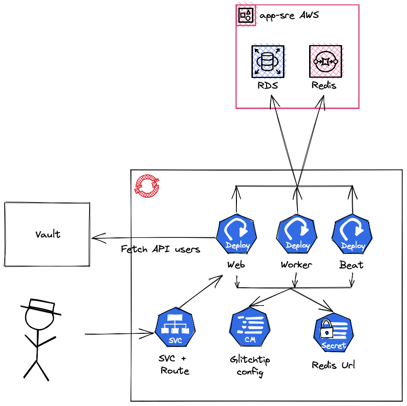

## Glitchtip architecture

## Main Components:

2. The `glitchtip-web` deployment: Runs the web-UI (glitchtip-frontend) and the django backend (glitchtip-backend).
3. The `glitchtip-worker` deployment: Runs the worker tasks (celery jobs) scheduled via the celery-beat.
1. The `glitchtip-beat` deployment: Runs the Celery tasks scheduler.

## CI/CD Pipeline

As soon as a PR is merged to the [`main` branch](https://github.com/app-sre/glitchtip), the CI/CD pipeline is triggered. The pipeline is defined in the [glitchtip saas](https://gitlab.cee.redhat.com/service/app-interface/-/blob/master/data/services/glitchtip/cicd/saas.yaml) and the [glitchtip test sass](https://gitlab.cee.redhat.com/service/app-interface/-/blob/master/data/services/glitchtip/cicd/test.yaml) in app-interface. The flow of the pipeline is as follows:

```mermaid
flowchart TD
    A[PR merged] --> B[Trigger 'glitchtip build main' jenkins job]
    B --> C[Deploy to stage]
    A --> D[Trigger test saas deployment]
    C -->|ready| E[Wait for stage deployment to be ready]
    D --> E
    E --> F[Run acceptance tests]
```

The acceptance tests are defined in the [glitchtip repo](https://github.com/app-sre/glitchtip/tree/main/acceptance) repository.

## Glitchtip

- Data is stored in Postgres AWS RDS service for both `stating` and `production` environments.
- This includes error data as sent by the Sentry SDK.
- The retention period for the stage environment is 14 days and for the production environment is 30 days.
