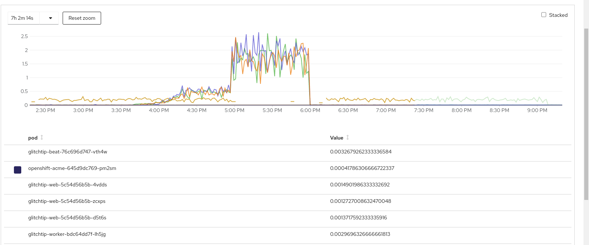
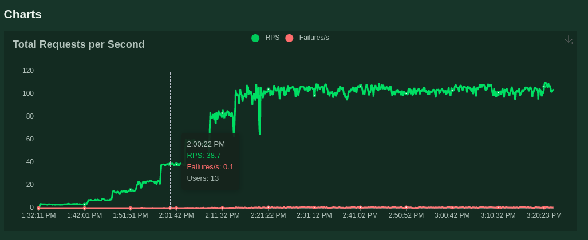
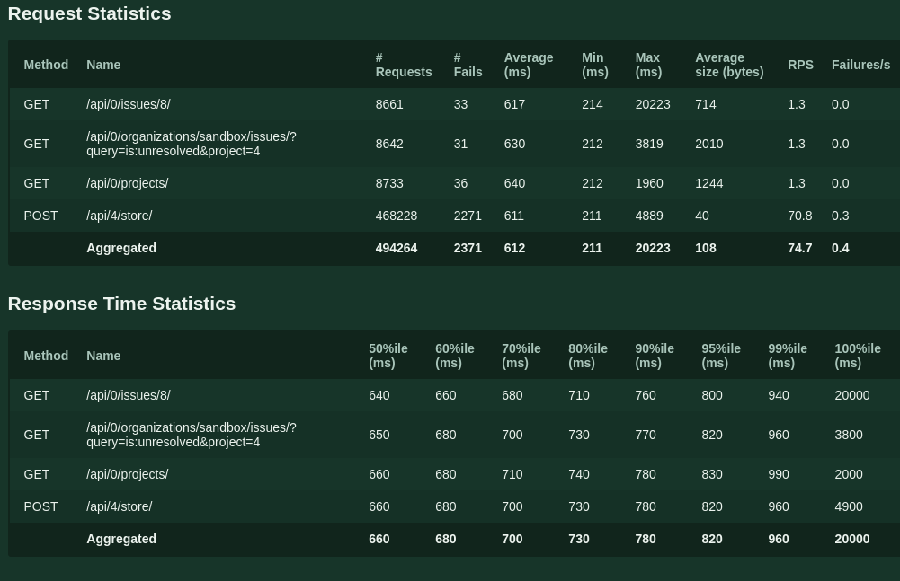
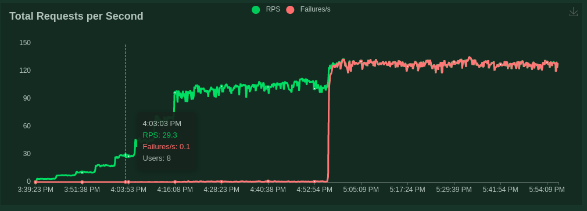
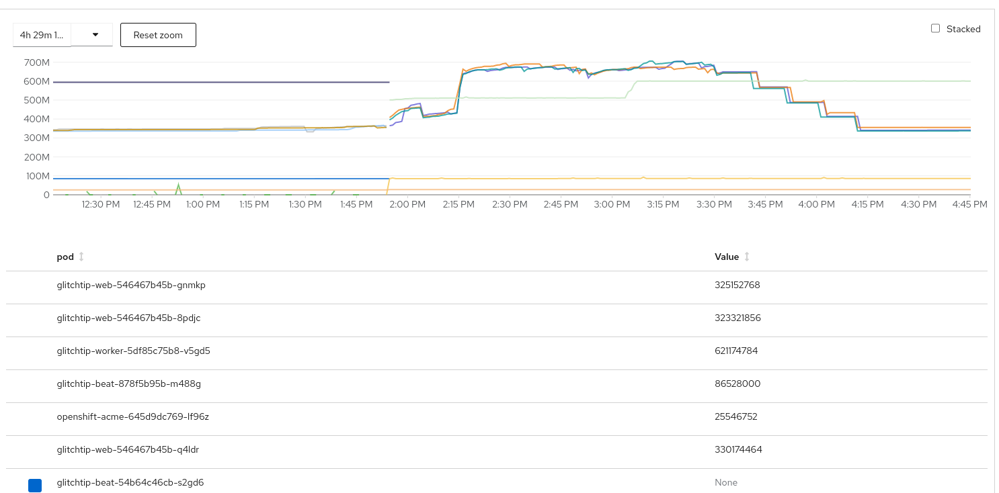

#  GlitchTip Service Load-Based Tests


# Prerequisities
- Please review glitchtip [API Documentation](https://app.glitchtip.com/docs)
- Python 3.8
- Docker
- To run the load tests, we need to have the service running somewhere. we can run the tests against the staging environment.

# Running the tests
### Step 1
Clone the [glitchtip tests](https://gitlab.cee.redhat.com/cssre/glitchtip-tests) repository.
### Step 2
Setup `.env` file in the root of the source code directory and add it to `.gitignore` file

### Step 3
- Generate a Glitchtip API token, login to the glitchtip instance in the appropriate organization
- Click `Create New Token` button and give you `Auth Token` a name and apply the appropriate permissions

- Get the `SENTRY_KEY` from appropriate organization, in the Client Keys(DSN)


### Step 4
```
# .env file
GT_API_TOKEN="<API TOKEN>"
SENTRY_KEY="<SENTRY-KEY>"
```
### Step 5
- run the `run-browsing-load1.sh`, `run-fibonacci-load.sh` based on required load testing profile.
# Overview

This document describes the strategy, execution, and results of GlitchtTip service (GT) load-based tests. These tests help infer the performance of GT by inducing custom load profiles.


# Problem Statements


1. What are the major load variables that directly affect the performance of GT?
2. Given the determined load variables in A, what are the load profiles we must use to test the GT service and therefore obtain generalized results?
3. What are the performance insights of the GT service when it was tested with the determined load profiles in B?
4. Are the current resource configurations of the GT service enough for production use cases?


# Strategy

Given the Relevant Challenges listed below, one of the effective methods to ensure insights are generated from load-based tests performed against GT and most importantly answer the questions listed in the Problem Statements section is by <span style="text-decoration:underline;">executing generalized load-based test cases</span>. These test cases can be inferred firstly by <span style="text-decoration:underline;">determining the performance of the service at load profiles idle, maximum, and median</span>. The user behavior in these profiles will be simulated <span style="text-decoration:underline;">using generalized usage profiles</span> as well based on what we know about the current Sentry usage and basically how errors are usually reported by an application. Through these test case results, one can then potentially <span style="text-decoration:underline;">extrapolate more specific load and user profiles and therefore create more specific test cases</span>. Most importantly, this strategy aims to make this load-based test process as <span style="text-decoration:underline;">repeatable as possible</span> so that it can be run later on with enhancements and therefore eliminate the need to redesign the test suite.


# Challenges


1. There is no officially published test data generated by any GT load-based test, therefore there is no baseline performance or load requirements to reference from.
2. GT has never been run or tested as a service internally in SRES, therefore there is no customer or user-related data available to reference.


# Limitations

The specific limitations of these load-based test cases are specified as they are described in this document. However, a major limitation is that as of this writing the strategy executed in these load-based tests is highly experimental due to the items described in the Challenges section.


## What are the major load variables that directly affect the performance of GT?

The major load variables that directly affect the performance of GT are:


1. **User request throughput** - This is the number of HTTP requests performed by a user or client per second or commonly known as Requests Per Second (RPS). Handling an HTTP request at least causes the following major computations in a server:
    1. CPU cycles for processing the request.
    2. IO cycles for network and file accesses (e.g. databases).
    3. Memory space for processing requests (e.g. cache, threads).
2. **Number of Users** - This is a multiplier of the user request throughput. The more users or clients using the service the more throughput is expected from the server.


## Given the determined load variables in A, what are the load profiles we must use to test the GT service and therefore obtain generalized results?

The load profiles we must use are:


1. A [load profile](https://gitlab.cee.redhat.com/cssre/glitchtip-tests/-/blob/main/locustio/scripts/test_fibonacci_load.py) that generates step-wise user load to identify the general performance of GT and answers the following questions. This load profile simply calls GT’s store API.
    1. How does GT perform when user load is increased?
    2. How does GT perform when the user load is U?
    3. When does GT start to generate errors?
    4. What happens to GT when there is an error?
2. A [load profile](https://gitlab.cee.redhat.com/cssre/glitchtip-tests/-/blob/main/locustio/scripts/browsing_load_1.py) that generates browsing load given GT is under user load of U and answers the following questions. This load profile calls GT’s store API and at the same time naively mimics user activity by calling GT’s APIs that view projects or issues.
    5. Is the GT UI still usable given user load U?


## What are the performance insights of the GT service when it was tested with the determined load profiles in B?

**Load Test Target:** GlitchTip Staging

**Load Profile 1:**


1. Errors started to occur at 29.3 req/s. See the kinds of errors below that were observed in this load profile.

    


* These errors occur intermittently until the req/s was raised to 97.1, they became almost constant and largely increased their frequency.
* It is also observed that in the peaks of the req/s that are caused by increasing the number of users, the errors consistently appear even if the req/s are relatively low.
* At 100+ req/s the failures/seconds overtook req/s.
* The 50% percentile request latency is 700 ms.

    


* Leaving the test at 100+ req/s made the worker pod crash due to OOM.

    


* CPU usage 

    	


* Memory usage

    	



	

**Insights**


1. At some points, GT became jittery with respect to handling increases in user load. This can affect SLOs.
2. Request errors started to occur even on low req/s. This can affect SLOs.
3. Worker OOM’ed after 100+ req/s. This highly can affect SLOs.

	**Kinds of Errors**


	* All of these errors cause to miss the client’s error reports.

**Load Profile 2:**


1. Errors started to occur at 38.7 req/s which coincides with load profile 1. See below the kinds of errors that occurred in this load profile. The jitter in the errors can also be observed in the following graph. See spikey red curve.

     



    **Kinds of Errors**

* These errors also occur in Load Profile 1 and also caused failed client requests not only for the store API but also for simple get APIs that can be invoked in the web pages when viewing issues or projects for example.

    


* There was over 4 times more error that occurred in this load profile even though it has a lesser user load in total.
* Response time is also 600+ ms which very similar to Load Profile 1.

    



* CPU usage

    



* Memory usage

    



**Insights**


1. The simple variation of user activity caused the latency and errors to increase compared to Load Profile 1.


## Are the current resource configurations of the GT service enough for production use cases?

From a performance/load-based test perspective, no. As seen in the graph, there are a couple of failure scenarios that can affect GT’s SLOs even on low req/s. Secondly, the observed jitter must be minimized and the cause of the massive failure of GT (e.g. worker OOM) at 100 req/s needs to be investigated further. All these failure scenarios will highly affect the proposed SLOs.

From a user’s perspective, maybe it’s enough in the short term as users may be more considerate knowing that GT is not a drop-in replacement of Sentry, or maybe their usage will be way lighter than the load profiles performed. But the jitter and failures at low req/s must be noted here because they seem to imply that even on a lighter load, they can occur and affect the proposed SLOs.
