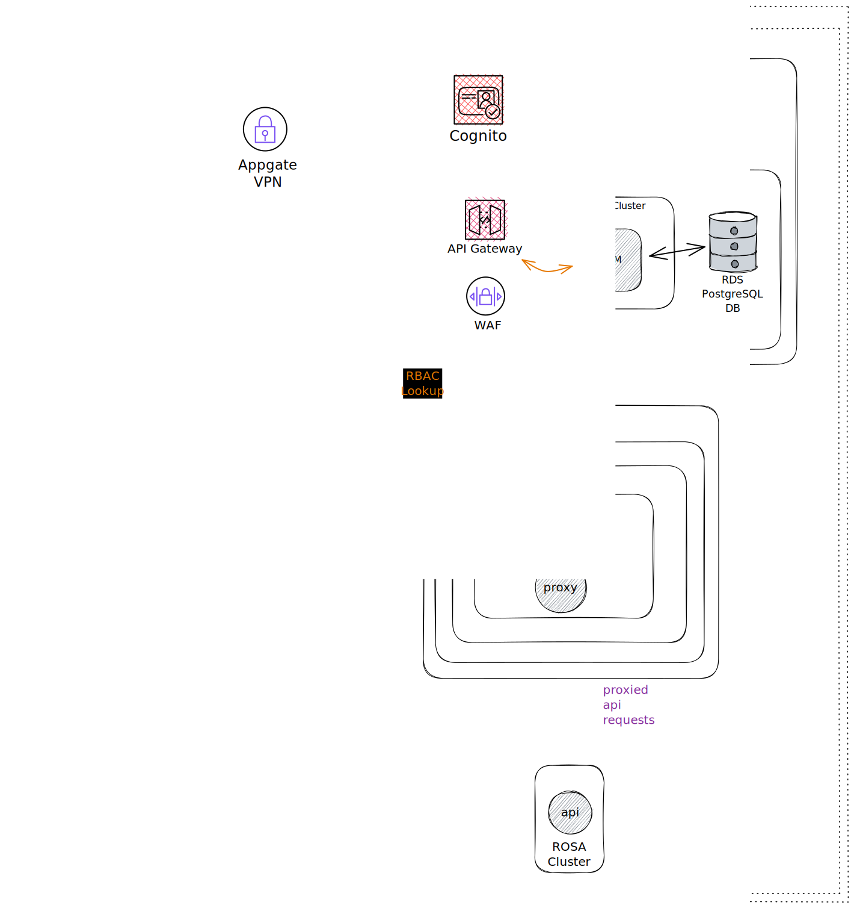

# Keycloak Architecture

## Service Description

- OCM on FedRAMP currently relies on Amazon Cognito for authenticating users. Cognito, however, does not support hard-token as an MFA mechanism. It only supports SMS and TOTP, both of which are considered soft tokens. Since FedRAMP High requires a hard token for MFA, the Appgate VPN was chosen to be used as an authentication choice to support hard token MFA. Appgate VPN presents problems with agencies that have strict requirements around 3rd party software such as appgate. The double authentication also creates a bad user experience for customers.
  
- Currently Cognito does not provide a way to manage users which creates manual toil for SREP/OCM teams to manually manage users with local tooling. Switching to Keycloak would also allow for better user and organization management.
  
- Red Hat's own SSO stack is powered by Keycloak, and so the entire OCM stack works natively with Keycloak's token verification mechanisms. Keycloak also supports OIDC identity brokering, allowing for hard token authentication using PIV/CAC through the customer’s own IdP.

## Components

- keycloak upstream built on UBI, bundled with bouncycastle FIPS jars to allow execution on fips-enabled OCP clusters

## Routes

- no exposed routing commercial-side as deployment is only intended to run in-boundary

## Dependencies

-   PostgreSQL DB via managed RDS in-boundary, none commercial-side

## Service Diagram

## Application Success Criteria

- OCM stack works natively with Keycloak's token verification mechanisms. Keycloak also supports OIDC identity brokering, allowing for hard token authentication using PIV/CAC through the customer’s own IdP.

## State

- The app requires a PostgreSQL Database (RDS) to function. The service should return an Internal Server error response if the Database is not available

## Load Testing

- N/A

## Capacity

- TBD
