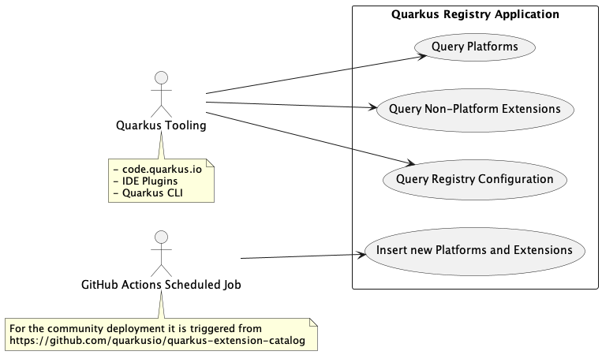
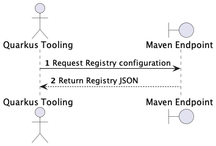
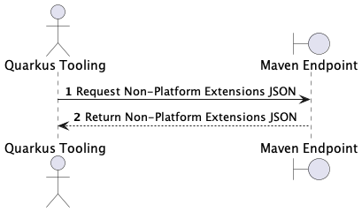
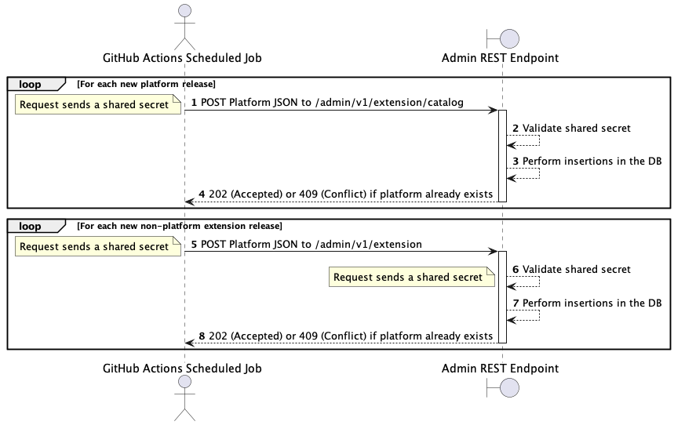

# Quarkus Extension Registry Architecture

## Service Description

The Quarkus Extension Registry application (registry.quarkus.io) provides a centralized place for tooling to query for extensions and
platforms. It is a Quarkus Application that has a PostgreSQL Database in the backend and exposes REST endpoints performing queries and insertions
in the underlying database.

## Components

### Use Case diagram

### Sequence diagram

#### Query Registry Configuration

#### Query Platforms

#### Query Non-Platform Extensions

#### Insert new Platforms and Extensions

## Routes

- Community
  - [https://registry.quarkus.io]() - Production
  - [https://stage.registry.quarkus.io]() - Staging

- Productized
    - [https://registry.quarkus.redhat.com]() - Production
    - [https://registry.quarkus.stage.redhat.com]() - Staging

## Dependencies

-   PostgreSQL 14 DB. API Endpoints should return 5xx errors if the Database isn't available.

## Service Diagram 

## Application Success Criteria

The application should return information about the released Quarkus platforms and extension versions including their metadata.

## State

- The app requires a PostgreSQL Database (RDS) to function. The service should return an Internal Server error response if the Database is not available

## Load Testing 

- In Progress

## Capacity

### CPU

- 0.5 - 1 CPU per pod

### Memory

- 300-1Gb RAM per pod

### Storage

- ~100Gb for the PostgreSQL Database

### Forecast for the next year (2023)

No plans to increase for the next year
