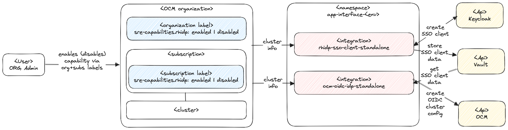

# Red Hat SSO IDP SRE Capability - Architecture

## Implementation pattern

The `rhidp` capability is implemented following the [Standalone service with OCM labels](https://service.pages.redhat.com/dev-guidelines/docs/sre-capabilities/framework/ocm-labels/).

Users place labels on OCM organizations and cluster subscriptions (see [docs](https://source.redhat.com/groups/public/sre/wiki/osdrosa_rover_based_user_management#documentation)). The `sre-capability` service account regularly issues fleet-wide config data discovery and reconciles SSO clients and OIDC configuration.

## Runtime

`rhidp` is running as two qontract-reconcile integrations (`ocm-oidc-idp` and `rhidp-sso-client`) in the `app-interface-<env>` namespaces. This is a temporary runtime solution until a dedicated runtime environment is defined to onboard the service into the app interface.

## Dependencies

### OCM

`rhidp` requires OCM access with a service account that holds the permissions from the [SRECapabilitiesService](https://gitlab.cee.redhat.com/service/uhc-account-manager/-/blob/master/pkg/api/roles/sre_capabilities_service.go) AMS role.

This role enables fleet wide label discovery and service log inspection/creation, as well as cluster group inspection/update permissions.

`rhidp` acts only on all OCM instances but within the allowed OCM organizations. See the [Onboarding an OCM organization with Red Hat SSO IDPp](./sops/onboard-an-ocm-organization.md) SOP for details.

### app-interface & AppSRE Vault

While `rhidp` is still a qontract-reconcile integration, it uses `app-interface` for configuration data about the available OCM environments. Also, it uses AppSRE Vault to store the created SSO clients.

The OCM service account tokens are directly consumed from AppSRE vault.

These dependencies will be resolved before `rhidp` can transition from a `qontract-reconcile` integration to a regular service.
