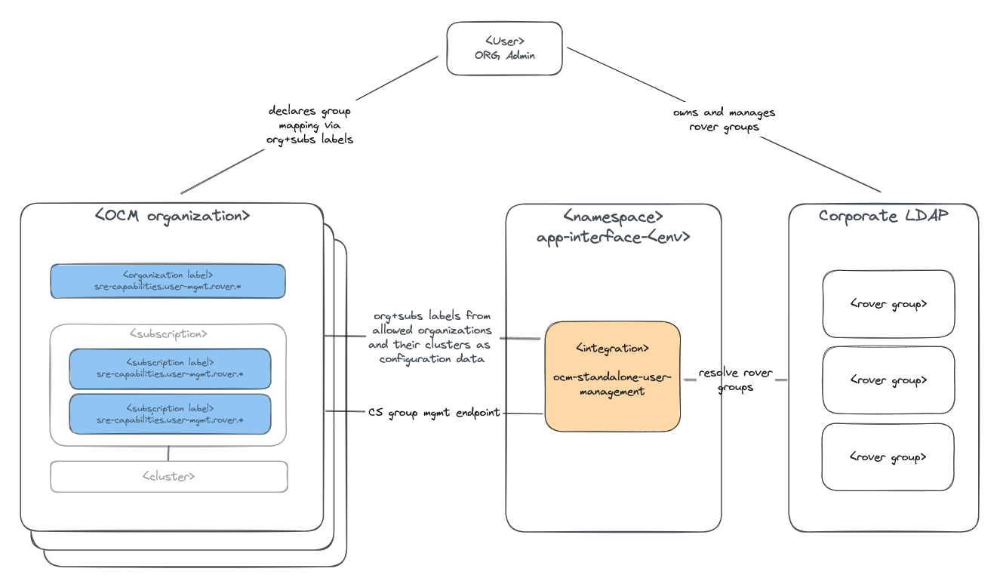

# User Management SRE Capability - Architecture

## Implementation pattern

The `user management` capability is implemented following the [Standalone service with OCM labels](https://service.pages.redhat.com/dev-guidelines/docs/sre-capabilities/framework/ocm-labels/).

Users place labels on OCM organizations and cluster subscriptions (see [docs](https://source.redhat.com/groups/public/sre/wiki/osdrosa_rover_based_user_management#documentation)). The `sre-capability` service account issues fleet-wide config data discovery on a regular basis and reconcile rover groups with cluster roles.

## Runtime

`user management` is running as a qontract-reconcile integration in the `app-interface-<env>` namespaces. This is a temporary runtime solution until a dedicated runtime environment has been defined with the intent to onboard the service into `app-interface`.

## Dependencies

### OCM

`user management` requires OCM access with a service account that holds the permissions from the [SRECapabilitiesService](https://gitlab.cee.redhat.com/service/uhc-account-manager/-/blob/master/pkg/api/roles/sre_capabilities_service.go) AMS role.

This role enables fleet wide label discovery and service log inspection/creation, as well as cluster group inspection/update permissions.

`user management` acts only on all OCM instances but only within allowed OCM organization. See the [Onboard an OCM organization with user management](./sops/onboard-an-ocm-organization.md) SOP for details.

### Corporate LDAP

`user management` needs access to the Red Hat corporate LDAP to resolve the members of Rover groups.

### app-interface & AppSRE Vault

For the time being, while `user management` is still a qontract-reconcile integration, it uses `app-interface` for configuration data about the available OCM environments and the corporate LDAP.

The OCM service account tokens are directly consumed from AppSRE vault.

These dependencies will be resolved before `user management` can transition from a `qontract-reconcile` integration to a regular service.
